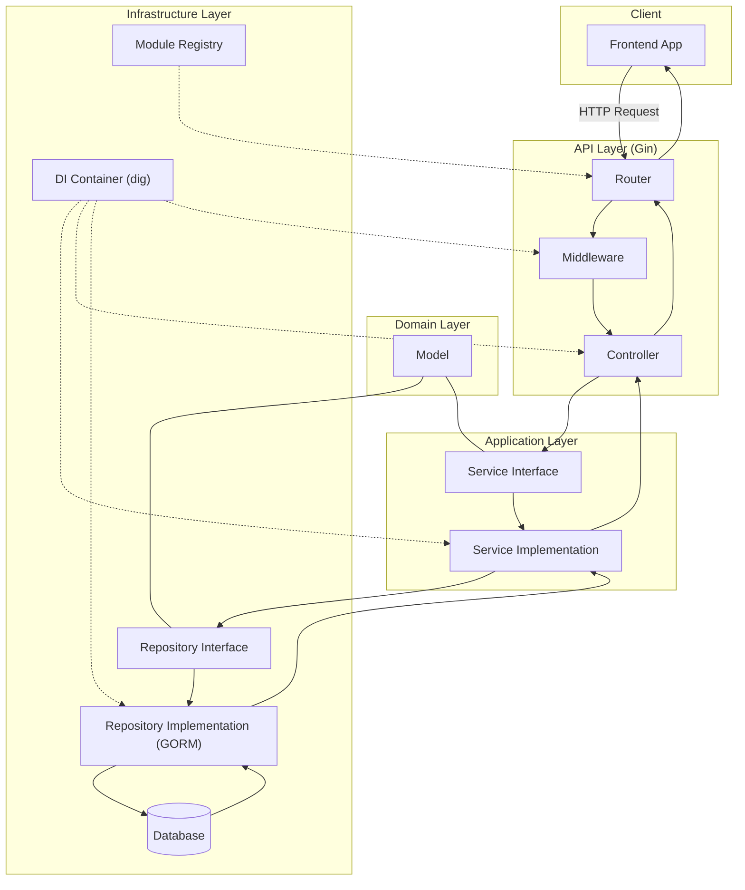

# 最终后端架构文档

## 目录
- [最终后端架构文档](#最终后端架构文档)
  - [目录](#目录)
  - [分层结构说明](#分层结构说明)
    - [Contracts (接口) 层](#contracts-接口-层)
    - [Repositories (仓储) 层](#repositories-仓储-层)
    - [Services (服务) 层](#services-服务-层)
    - [Controllers (表现) 层](#controllers-表现-层)
    - [Apps (模块化) 层](#apps-模块化-层)
    - [Middlewares (中间件) 层](#middlewares-中间件-层)
  - [组件设计说明](#组件设计说明)
    - [模块化自注册模式](#模块化自注册模式)
    - [DI（依赖注入）机制](#di依赖注入机制)
    - [基于接口组合和实现嵌入的统一服务模式](#基于接口组合和实现嵌入的统一服务模式)
    - [通用的中间件架构](#通用的中间件架构)
  - [架构图](#架构图)

## 分层结构说明

本项目的后端架构严格遵循分层架构原则，通过接口组合和代码嵌入实现高内聚、低耦合。整体结构清晰，职责分明，便于维护和扩展。

### Contracts (接口) 层

- **职责**: 定义服务和仓储的接口，是解耦的关键。
- **核心实现**:
    - `GenericCRUD` 和 `GenericRepository` 接口定义了基础的 CRUD 操作。
    - 具体模块（如 `works`）通过组合这些基础接口来定义自己的服务接口（如 `WorkService`），确保了接口的灵活性和可扩展性。

### Repositories (仓储) 层

- **职责**: 实现数据持久化逻辑，封装与数据库的交互。
- **核心实现**:
    - `GenericGormRepository` 提供了一个通用的 GORM 仓储实现，封装了常见的数据库操作。
    - 具体模块（如 `works`）通过嵌入 `GenericGormRepository` 来复用代码，同时可以添加模块特有的数据访问方法。

### Services (服务) 层

- **职责**: 实现核心业务逻辑，处理数据转换和业务规则。
- **核心实现**:
    - `GenericService` 提供了一个通用的服务实现，封装了常见的业务逻辑。
    - 具体模块（如 `works`）通过嵌入 `GenericService` 来复用代码，并实现自己的特有业务方法（如 `Publish`）。
    - 服务层只依赖于 `Repository` **接口**，不依赖具体实现，实现了业务逻辑与数据访问的分离。

### Controllers (表现) 层

- **职责**: 处理 HTTP 请求和响应，进行参数校验和数据转换。
- **核心实现**:
    - 控制器层只依赖于 `Service` **接口**，不依赖具体实现，专注于处理 HTTP 协议相关的工作。
    - 通过 Gin 框架提供的功能，实现路由绑定、参数解析、请求处理和响应返回。

### Apps (模块化) 层

- **职责**: 实现模块化自注册，管理模块的路由和依赖。
- **核心实现**:
    - 每个业务模块（如 `works`, `chapters`）都是一个独立的单元，包含自己的 `module.go` 文件。
    - 模块通过 `init()` 函数将自己注册到全局的模块注册表，并将组件的构造函数注册到 DI 容器。
    - 在 `RegisterRoutes` 方法中，模块从 DI 容器获取自己的 Controller 实例，并注册路由。

### Middlewares (中间件) 层

- **职责**: 处理横切关注点，如认证、授权、日志、资源验证等。
- **核心实现**:
    - 实现了通用中间件架构，通过统一的中间件接口、自动注册机制和依赖注入，实现了中间件的灵活管理和使用。
    - 提供了认证中间件、资源存在性验证中间件、资源所有权验证中间件等。

## 组件设计说明

### 模块化自注册模式

模块化自注册模式是本架构的核心之一，它使得系统具有高度的可扩展性和可维护性。

1.  **模块定义**: 每个业务功能（如作品管理、章节管理）被封装在一个独立的模块中，位于 `backend/internal/apps/` 目录下。
2.  **自动注册**: 每个模块在其 `module.go` 文件的 `init()` 函数中，通过调用 `apps.Register()` 将自己注册到全局的模块注册表。同时，它会将自己所需的组件（Repository, Service, Controller）的构造函数通过 `container.Container.Provide()` 注册到 DI 容器。
3.  **路由注册**: 每个模块实现 `RegisterRoutes` 方法，在其中从 DI 容器获取 Controller 实例，并将路由和对应的处理器函数注册到 Gin 路由器。
4.  **应用启动**: 在应用启动时（`cmd/api.go`），通过空白导入 (`_ "novel-man/backend/internal/apps/works"`) 的方式导入所有需要启用的模块。Go 的运行时会自动执行每个模块的 `init()` 函数，完成模块和组件的注册。随后，主程序会遍历所有已注册的模块，调用它们的 `RegisterRoutes` 方法，完成路由的注册。

这种模式的优势在于：
- **低耦合**: 主程序不需要知道具体有哪些模块，也不需要手动初始化和注册它们。
- **高内聚**: 每个模块管理自己的依赖和路由，职责清晰。
- **易扩展**: 增加新功能时，只需创建新的模块目录和文件，无需修改现有代码。

### DI（依赖注入）机制

依赖注入（DI）机制是实现控制反转（IoC）的关键，它进一步降低了组件之间的耦合度。

1.  **DI 容器**: 使用 `go.uber.org/dig` 作为全局的依赖注入容器 (`backend/internal/container/container.go`)。
2.  **Provider 注册**: 每个组件（Repository, Service, Controller）都提供一个 `New...` 构造函数作为 Provider，并在模块的 `init()` 函数中通过 `container.Container.Provide()` 将其注册到 DI 容器。
3.  **依赖解析**: 当需要使用某个组件时（例如在 `apps/works/module.go` 的 `RegisterRoutes` 方法中需要 `WorkController`），通过 `container.Container.Invoke()` 调用一个函数，DI 容器会自动解析该函数的参数（`*works.WorkController`），查找已注册的 Provider（`works.NewWorkController`），并递归地解析 `WorkController` 构造函数的参数（`works.WorkService`），直到所有依赖都被解析并注入，最后调用该函数。

这种机制的优势在于：
- **自动装配**: 开发者无需手动创建和管理组件实例及其依赖关系。
- **易于测试**: 可以轻松地用 Mock 对象替换真实组件进行单元测试。
- **代码简洁**: 减少了大量的样板代码，使代码更加清晰。

### 基于接口组合和实现嵌入的统一服务模式

为了最大化代码复用并保持架构的清晰性，我们采用了基于接口组合和实现嵌入的统一服务模式。

1.  **接口组合 (Interface Composition)**:
    - 在 `contracts` 层，我们没有定义一个庞大而复杂的顶层接口，而是定义了多个小型、功能单一的基础接口（如 `GenericCRUD`, `GenericRepository`）。
    - 具体模块的接口（如 `WorkService`）通过组合这些基础接口来获得所需的能力。例如，`WorkService` 接口组合了 `GenericCRUD[models.Work, int64]` 和 `WorkPublish` 接口。这种方式使得接口更加灵活，易于理解和扩展。

2.  **实现嵌入 (Implementation Embedding)**:
    - 在 `services` 和 `repositories` 层，我们提供了通用的基类实现（如 `GenericService`, `GenericGormRepository`）。
    - 具体模块的实现（如 `WorkService`, `WorkGormRepository`）通过结构体嵌入（Embedding）这些基类来复用代码。例如，`WorkService` 结构体嵌入了 `*GenericService[models.Work, int64, works.WorkRepository]`，从而自动获得了 `Create`, `GetByID`, `Update`, `Delete`, `List` 等通用方法的实现。
    - 如果模块有特有方法，可以在自己的结构体中实现。例如，`WorkService` 实现了 `Publish` 方法。

这种模式的优势在于：
- **高代码复用**: 通用的 CRUD 逻辑只需实现一次，所有模块都可以复用。
- **清晰的职责分离**: 基类处理通用逻辑，具体类处理特有逻辑。
- **易于维护**: 修改通用逻辑时，只需修改基类实现。

### 通用的中间件架构

为了统一处理横切关注点，我们设计并实现了一个通用的中间件架构。

1.  **统一接口**: 定义了 `middlewares.Middleware` 接口，包含 `Handler() gin.HandlerFunc` 和 `Name() string` 方法，确保了所有中间件的一致性。
2.  **自动注册**: 通过 `middlewares.MiddlewareInitializer` 接口和 `dig.Group("middleware_initializers")`，实现了中间件的自动注册。每个中间件模块（如 `auth`, `resource`）在 `init()` 函数中将初始化器注册到 DI 容器的特定组中。在 `middlewares/module.go` 中，会从 DI 容器获取所有初始化器，并创建中间件实例，注册到全局的中间件注册表。
3.  **灵活使用**: 在模块的路由注册中，通过 `middlewares.MiddlewareProvider` 从注册表中获取指定名称的中间件实例，并将其应用到路由上。

这种架构的优势在于：
- **统一管理**: 所有中间件都遵循相同的模式，便于管理。
- **易于扩展**: 增加新的中间件类型非常简单。
- **按需使用**: 每个模块可以根据需要获取和使用所需的中间件。

## 架构图

