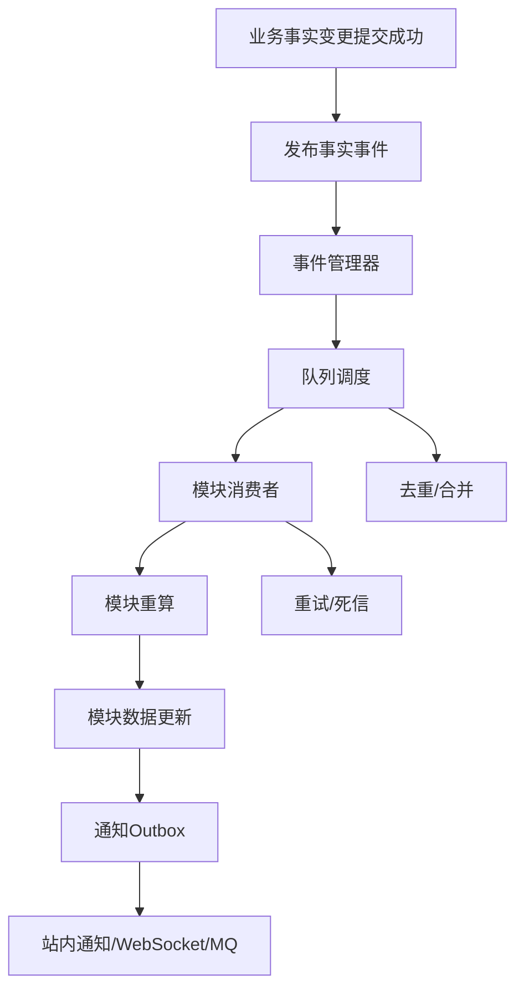
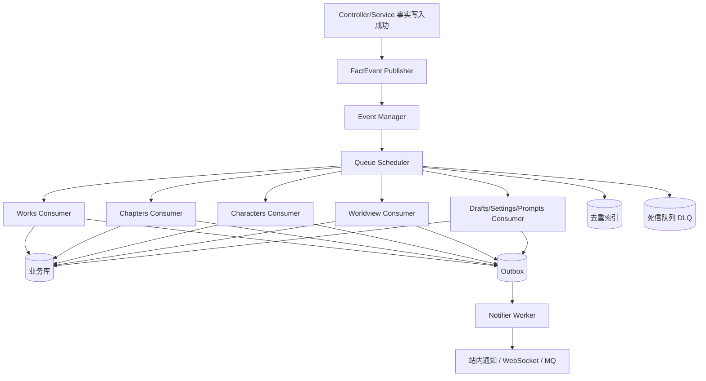
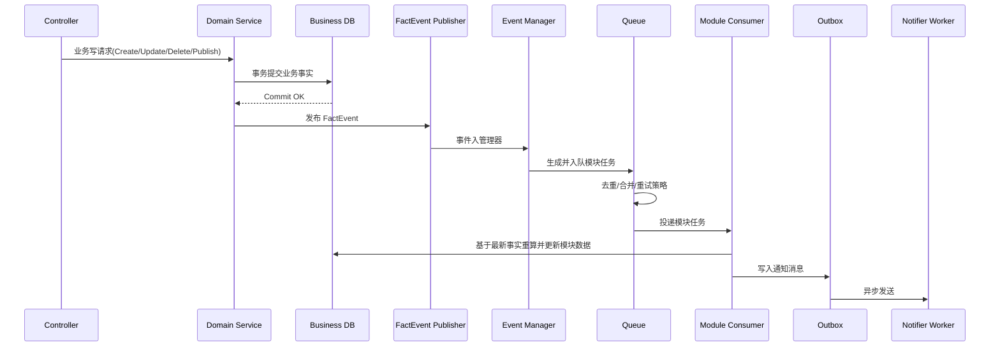
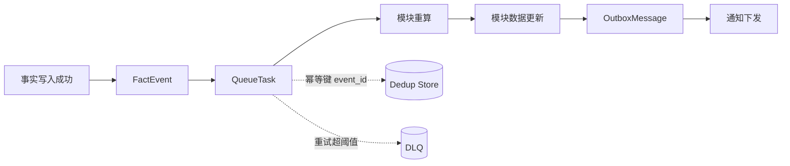

# 事件触发的模块自治更新设计

## 1. 设计目标

本设计只解决一件事：

**业务事实发生变更后，如何由系统稳定、准确地完成各模块的数据重算与更新。**

核心要求：

1. 事件驱动。
2. 模块自治。
3. 队列防重复。
4. 抗惊群。
5. 可扩展通知。

---

## 2. 核心原则

1. 触发条件只有一个：业务事实变更成功提交。

2. 每个模块对自己的数据负责，自己重算，自己更新。
3. 更新逻辑必须尊重事实逻辑。
4. 队列负责削峰、去重、重试，不在请求链路里做重算。

---

## 3. 总体模型



---

## 4. 事件模型

事件只表达事实，不表达实现细节。

```text
FactEvent {
  event_id,
  event_type,
  aggregate_type,
  aggregate_id,
  occurred_at,
  producer,
  payload,
  trace_id
}
```

说明：

1. `event_id`：全局唯一，用于幂等。
2. `event_type`：事件类型（如章节创建、草稿发布等）。
3. `aggregate_type/aggregate_id`：指向发生变更的业务对象。
4. `payload`：必要业务上下文。

---

## 5. 触发规则

### 5.1 触发源

只要业务事实变更提交成功，就发布事件。

典型场景：

1. 章节创建/修改/删除。
2. 草稿发布。
3. 角色与作品关系变更。
4. 世界观与作品关系变更。
5. 其他会改变模块结果的数据变更。

### 5.2 非触发源

以下行为不发布事件：

1. 列表查询。
2. 详情查询。
3. 搜索/筛选/分页/排序。

---

## 6. 模块自治模型

每个模块注册自己的消费者，定义三件事：

1. 订阅哪些事件。
2. 如何基于当前事实进行重算。
3. 如何更新本模块数据。

边界规则：

1. 模块只能更新本模块负责的数据。
2. 禁止跨模块直接更新。
3. 模块更新逻辑必须可重复执行（幂等）。

---

## 7. 队列与并发控制

### 7.1 队列职责

1. 入队。
2. 去重。
3. 合并。
4. 调度。
5. 重试。
6. 死信。

### 7.2 防重复

1. 同一 `event_id` 只处理一次。
2. 短时间重复事件可合并后再处理。
3. 重算基于最新事实快照，避免重复计算污染结果。

### 7.3 抗惊群

1. 同一业务对象相关任务串行处理。
2. 模块消费者并发上限控制。
3. 失败重试使用指数退避与抖动。
4. 超阈值任务进入死信，避免持续冲击主系统。

---

## 8. 更新语义

这里不定义“局部更新”或“全量更新”为默认策略。

统一原则只有一个：

**更新动作必须与当前事实一致。**

即：

1. 先基于事实重算出目标结果。
2. 再按模块规则执行更新。
3. 保证更新后状态与事实一致。

---

## 9. 通知扩展

数据更新完成后，写入通知 Outbox，再异步下发。

支持通道：

1. 站内通知。
2. WebSocket。
3. 外部消息系统。

要求：

1. 通知失败可重试。
2. 通知故障不阻塞主更新链路。

---

## 10. 验收标准

1. 查询行为不会触发任何更新。
2. 每次更新都可追溯到事实事件。
3. 高频事件下无明显重复重算。
4. 无惊群导致的数据库抖动。
5. 通知链路故障不影响主流程。

---

## 11. 最终结论

统一链路：

**事实变更 -> 发布事件 -> 队列调度 -> 模块重算 -> 模块更新 -> 通知Outbox**

该设计满足：

1. 触发清晰（只看事实变更）。
2. 职责清晰（模块自治）。
3. 并发可控（防重复、抗惊群）。
4. 易于扩展（通知与新模块接入）。

---

## 12. 后端落地架构方案（纯事件驱动）

本章节基于“事实事件 -> 队列 -> 模块消费者 -> 模块更新 -> Outbox 通知”主链路。
可执行实施细节（阶段、任务、里程碑、交付物、验收映射）统一以主文档为准：`docs/design/universal-write-governance-executable-blueprint.md`。

### 12.1 组件架构（可直接实施）



### 12.2 组件职责与边界

1. 事实发布器：仅在“业务事实提交成功后”发布事件，不在提交前发事件。
2. 事件管理器：只做事件路由、任务生成，不承担业务重算逻辑。
3. 队列调度器：负责去重、合并、重试、死信，不做业务计算。
4. 模块消费者：按模块自治重算并更新“本模块数据”，禁止跨模块直写。
5. Outbox 工作者：异步发送通知，通知失败不影响主更新链路。

### 12.3 写入主链路时序



### 12.4 数据流定义



关键数据对象：

1. FactEvent：`event_id`、`event_type`、`aggregate_type`、`aggregate_id`、`occurred_at`、`payload`、`trace_id`。
2. QueueTask：`task_id`、`module`、`event_id`、`partition_key`、`retry_count`、`next_retry_at`。
3. OutboxMessage：`message_id`、`module`、`channel`、`payload`、`status`、`retry_count`。

### 12.5 并发与一致性控制

1. 分区键：`aggregate_type + aggregate_id + module`，同键串行，不同键并行。
2. 去重键：`event_id + module`，避免同事件对同模块重复处理。
3. 重算原则：总是读取最新事实快照，不依赖历史中间态。
4. 重试策略：指数退避 + 抖动，达到阈值转入 DLQ。
5. 幂等原则：消费者执行前检查去重索引，保证重复投递不产生脏写。

### 12.6 与现有后端代码的集成点

1. `backend/internal/services/*`：在事实写入成功后统一调用 FactEvent 发布接口。
2. `backend/internal/cmd/construct.go`：注册事件管理器、队列调度器、消费者与 Outbox Worker。
3. `backend/internal/services/works/work_service.go`：将现有派生刷新能力纳入消费者执行链。
4. `backend/internal/controllers/works/handler.go`：移除读请求触发重算，改为仅消费事件更新。
5. `backend/internal/repositories/gorm/*`：为各模块补充最小补丁更新接口，支撑高频重算落库。

### 12.7 分阶段落地计划

1. Phase A：实现 FactEvent Publisher + Event Manager + Queue（含去重/重试/DLQ）。
2. Phase B：works 模块先切换到“事件触发重算”，下线 GET 触发重算路径。
3. Phase C：推广到 chapters/characters/worldview/drafts/settings/prompts。
4. Phase D：补齐 Outbox 全通道通知与全链路指标告警。

### 12.8 验收补充（工程可测）

1. 查询接口压测期间，数据库无新增写操作。
2. 同一 `event_id` 重放 100 次，模块结果一致。
3. 高频更新下，队列无惊群导致的连接池抖动。
4. 通知通道故障时，主链路成功率维持稳定。
