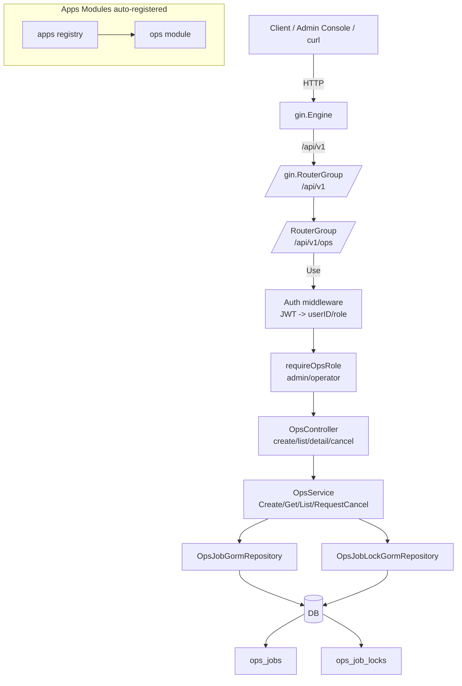
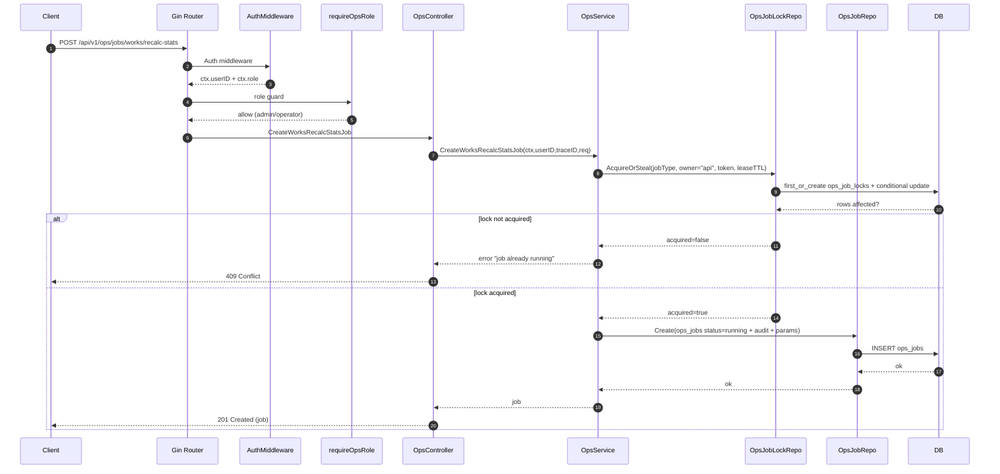
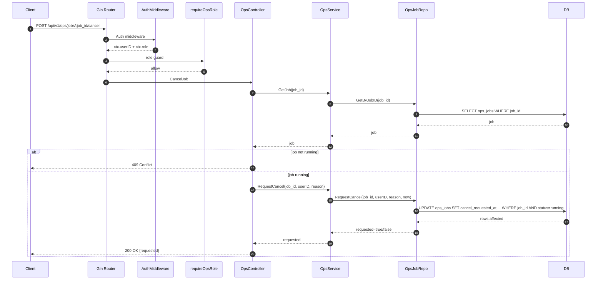

# Admin Console MVP（Milestone 2）对话实现总结（交接 + 验收）

> 文档定位：**交接 + 验收对照**。用于让后续接手者快速理解“做到哪了/为什么这么做/下一步怎么做”，并提供可执行的验证与运维手册。
>
> 对齐主指南：[`docs/guides/admin-console-mvp-guide.md`](docs/guides/admin-console-mvp-guide.md:1)

---

## 1. 目标与范围

### 1.1 原始目标（按指南）
指南要求在管理后台 MVP 中完成：
- Ops API + Job 体系（先 API，再 UI）：[`docs/guides/admin-console-mvp-guide.md`](docs/guides/admin-console-mvp-guide.md:55)
- `works.recalc_stats` 数据治理作业：[`docs/guides/admin-console-mvp-guide.md`](docs/guides/admin-console-mvp-guide.md:102)
- 权限模型：`role in {admin, operator}`，替换临时 `userID == 1`：[`docs/guides/admin-console-mvp-guide.md`](docs/guides/admin-console-mvp-guide.md:84)

### 1.2 本次实现范围（实际落地到仓库的内容）
已落地（完成）：
1) 角色字段 + JWT role + Gin context 注入 role
2) 替换 settings 的 `userID==1` 临时判定为 role-based
3) `ops_jobs` / `ops_job_locks` 的数据模型 + AutoMigrate 接入
4) Ops API（路由/DI/controller/service）实现：支持 create/list/detail/cancel(request)
5) `ops_jobs` 与 `ops_job_locks` 的 GORM repository（用于 Ops API + runner）
6) `events.EventTypeWorksRecalcStats` + works module routes 注册（runner 投递通路）
7) `works.recalc_stats` 作业执行 runner（批量 Dispatch work stats 重算任务 + 续租/进度上报 + cancel ack + 写终态）
8) 最小可行单测 + 工程校验：包含 ops service 单测 + repo lease where 保护测试 + runner 不 panic 测试；`cd backend && go test ./...` 通过

未落地（待做）：
- 前端 Admin Console UI（Milestone 1）

---

## 2. 关键决策（Why）

### 2.1 Role 模型：`users.role`（默认 `user`）
- 决策：在 `users` 表增加 `role` 字段；JWT 里携带 role；但服务端以 DB 为准注入 role 到 Gin context（避免 token 过期/脏数据）。
- 证据位置：
  - `User.Role` 字段：[`backend/internal/models/models.go`](backend/internal/models/models.go:1)
  - JWT 生成包含 role：[`AuthService.Login()` / `GenerateToken` 逻辑](backend/internal/services/auth/auth_service.go:1)
  - 中间件从 DB 读取 role 并注入：[`AuthMiddleware.Handler()`](backend/internal/middlewares/auth/auth.go:55)

### 2.2 Ops Job 全局唯一：跨 DB 的锁表方案（推荐 MVP 默认）
- 背景：项目需要兼容 MySQL/Postgres/SQLite，且迁移采用 GORM AutoMigrate。
- 决策：采用统一 fallback：`ops_job_locks`（按 `job_type` 主键唯一）实现“同 job_type 同一时间最多一个 running”的集群安全入口；并通过 `lease_expires_at` 支持超时接管。
- 设计稿：[`tasks/admin-console-mvp/2.1_design/ops_jobs-model-and-uniqueness.md`](tasks/admin-console-mvp/2.1_design/ops_jobs-model-and-uniqueness.md:1)
- 落地模型：[`backend/internal/models/ops_job_lock.go`](backend/internal/models/ops_job_lock.go:18)
- 落地 repo：[`OpsJobLockGormRepository.AcquireOrSteal()`](backend/internal/repositories/gorm/ops_job_repository.go:86)

---

## 3. 已完成内容（What）

### 3.1 权限与认证（Milestone 2 的一部分）
- 实现：
  - `users.role` 字段默认 `user`
  - 注册默认 role=`user`
  - JWT 带 role claim
  - Auth middleware 注入 `userID` 与 `role`
- 替换临时 admin 判定：
  - settings 列表接口改为 `role in {admin, operator}`：[`SettingController.ListSettings()`](backend/internal/controllers/settings/handler.go:239)

### 3.2 ops_jobs 设计与模型（Milestone 0 的基础设施）
- 设计文档已产出：[`tasks/admin-console-mvp/2.1_design/ops_jobs-model-and-uniqueness.md`](tasks/admin-console-mvp/2.1_design/ops_jobs-model-and-uniqueness.md:1)
- 数据模型：
  - 作业：[`backend/internal/models/ops_job.go`](backend/internal/models/ops_job.go:20)
  - 锁：[`backend/internal/models/ops_job_lock.go`](backend/internal/models/ops_job_lock.go:18)
- 迁移接入（AutoMigrate）：在启动迁移中加入 `OpsJob`/`OpsJobLock`（位置：[`backend/internal/cmd/root.go`](backend/internal/cmd/root.go:1)）

### 3.3 ops module 工程实现（已完成）
- 已实现并接入：
  - module（注册 + DI + 路由 + role guard）：[`backend/internal/apps/ops/module.go`](backend/internal/apps/ops/module.go:1)
  - controller（create/list/detail/cancel endpoints）：[`backend/internal/controllers/ops/handler.go`](backend/internal/controllers/ops/handler.go:1)
  - service（抢锁 + 创建 running job + 查询 + request cancel）：[`backend/internal/services/ops/ops_service.go`](backend/internal/services/ops/ops_service.go:1)
  - contracts（DTO + OpsService 接口）：[`backend/internal/contracts/ops/service.go`](backend/internal/contracts/ops/service.go:1)
- 模块导入已激活：[`backend/internal/cmd/construct.go`](backend/internal/cmd/construct.go:3)
- 最小单测已补齐：[`backend/internal/services/ops/ops_service_test.go`](backend/internal/services/ops/ops_service_test.go:1)

### 3.4 repository（用于 Ops API + runner）
- 作业 repo：[`OpsJobGormRepository`](backend/internal/repositories/gorm/ops_job_repository.go:13)
  - Ops API：`Create()` / `GetByJobID()` / `List()` / `RequestCancel()`（两段式取消：request 段）
  - Runner：`ScanRunningJobs()` / `TryStealLease()` / `RenewLease()` / `SetProgressTotal()` / `UpdateProgressMonotonic()` / `AckCancel()` / `Finalize()` / `ReleaseLease()`
  - where 保护单测：[`TestOpsJobRepo_RenewLeaseWhereProtection()`](backend/internal/repositories/gorm/ops_job_repository_lease_test.go:15)
- 锁 repo（全局唯一入口）：[`OpsJobLockGormRepository`](backend/internal/repositories/gorm/ops_job_repository.go:243)
  - `AcquireOrSteal()` / `Renew()` / `Get()`

---

## 4. 当前状态快照（Where we are）

### 4.1 能力完成度
- ✅ 数据层：models + migration + repo
- ✅ API 层：Ops routes/controller/service 已实现（create/list/detail/cancel(request)）
- ✅ 执行层：runner 已实现（抢占/续租 lease、分页扫描 works、Dispatch 投递、progress flush、cancel ack、finalize）
  - 实现汇总：[`tasks/admin-console-mvp/2.3_impl/ops_runner-implementation-summary.md`](tasks/admin-console-mvp/2.3_impl/ops_runner-implementation-summary.md:1)
  - runner 入口：[`runner.WorksRecalcStatsRunner.Start()`](backend/internal/services/ops/runner/works_recalc_stats_runner.go:100)
- ❌ UI 层：未开始
- ✅ 基本工程可用性：`cd backend && go test ./...` 通过（包含 ops service 单测 + repo where 保护 + runner 不 panic）

### 4.2 与里程碑的对应关系
详见指南里程碑：[`docs/guides/admin-console-mvp-guide.md`](docs/guides/admin-console-mvp-guide.md:201)
- Milestone 0（Ops API + Job）：**已完成**（Ops API + job runner 闭环已打通）
- Milestone 1（UI）：未开始
- Milestone 2（权限与审计硬化）：**部分完成**（role-based 已完成；终态/取消 ack 已由 runner 落盘，但更细粒度“按 work 执行结果聚合”仍可后续增强）

### 4.3 当前已实现功能清单（可验收）

#### 4.3.1 Ops API（HTTP）
- 路由前缀：`/api/v1/ops`（模块注册机制：[`router.InitRouter()`](backend/internal/router/router.go:16) → 遍历模块 [`apps.GetRegisteredModules()`](backend/internal/apps/registry.go:1)）
- 权限链路：JWT → Auth middleware 注入 `userID/role` → ops role guard（`role in {admin, operator}`）
  - Auth middleware：[`AuthMiddleware.Handler()`](backend/internal/middlewares/auth/auth.go:55)
  - Ops role guard：[`requireOpsRole()`](backend/internal/apps/ops/module.go:71)

已实现端点（见 [`(*opsModule).RegisterRoutes()`](backend/internal/apps/ops/module.go:35) + [`OpsController`](backend/internal/controllers/ops/handler.go:16)）：
- `POST /api/v1/ops/jobs/works/recalc-stats`：创建 `works.recalc_stats` 作业（全局唯一入口：锁表）
- `GET /api/v1/ops/jobs`：分页列表（支持 `type/status/page/limit`）
- `GET /api/v1/ops/jobs/:job_id`：详情
- `POST /api/v1/ops/jobs/:job_id/cancel`：请求取消（两段式 cancel 的第一段：写 cancel_requested_at 等字段）

#### 4.3.2 Ops Job 数据与一致性
- 数据表（GORM models）：
  - `ops_jobs`：[`models.OpsJob`](backend/internal/models/ops_job.go:20)
  - `ops_job_locks`：[`models.OpsJobLock`](backend/internal/models/ops_job_lock.go:18)
- 全局唯一（同 `job_type` 同时最多 1 个 running job）：
  - API 创建 job 时先抢锁：[`opsService.CreateWorksRecalcStatsJob()`](backend/internal/services/ops/ops_service.go:36)
  - 锁实现（跨 DB fallback）：[`OpsJobLockGormRepository.AcquireOrSteal()`](backend/internal/repositories/gorm/ops_job_repository.go:88)
- 请求取消：[`OpsJobGormRepository.RequestCancel()`](backend/internal/repositories/gorm/ops_job_repository.go:59)

#### 4.3.3 最小单测与工程校验
- 最小单测（锁冲突 + cancel 仅对 running 生效）：[`backend/internal/services/ops/ops_service_test.go`](backend/internal/services/ops/ops_service_test.go:1)
- 工程校验：`go fmt ./...` + `go test ./...`（backend 目录下）

### 4.4 当前架构设计（Ops Job 子系统）

#### 4.4.1 代码架构（模块化单体 + DI + Repository）
- 入口：[`router.InitRouter()`](backend/internal/router/router.go:16)
- 模块激活：通过空白导入触发各模块 `init()` 注册（含 ops）：[`backend/internal/cmd/construct.go`](backend/internal/cmd/construct.go:1)
- ops 模块内部：`init()` 注册模块 + DI 提供 repo/service/controller；`RegisterRoutes()` 负责挂载路由与中间件：[`backend/internal/apps/ops/module.go`](backend/internal/apps/ops/module.go:23)

#### 4.4.2 架构图（组件视图）


#### 4.4.3 流程图：创建 Job（works.recalc_stats）


#### 4.4.4 流程图：请求取消 Job（两段式 cancel 的第一段）


---

## 5. 下一步实施计划（How to continue）

> 本节按“阶段化交付”记录：哪些已经做完、下一步做什么；**不删除已完成步骤**，避免流程错乱。

### 5.0 当前进度标记（摘要）
- [x] **5.1 ops module 的 DI + 路由**（已完成）
  - 实现位置：[`backend/internal/apps/ops/module.go`](backend/internal/apps/ops/module.go:1)
- [x] **5.2 Ops API endpoints**（已完成）
  - Controller：[`backend/internal/controllers/ops/handler.go`](backend/internal/controllers/ops/handler.go:29)
  - Service：[`backend/internal/services/ops/ops_service.go`](backend/internal/services/ops/ops_service.go:36)
  - Repo：[`backend/internal/repositories/gorm/ops_job_repository.go`](backend/internal/repositories/gorm/ops_job_repository.go:13)
- [x] **5.3 runner**（已完成）：推进 job 到终态（lease/续租/progress/cancel ack）
  - 实现汇总：[`tasks/admin-console-mvp/2.3_impl/ops_runner-implementation-summary.md`](tasks/admin-console-mvp/2.3_impl/ops_runner-implementation-summary.md:1)

> 结果：已打通“创建 job → runner 推进并投递 → 终态落盘（含 cancel ack）”闭环。

### 5.1 补齐 ops module 的 DI + 路由（已完成，保留原计划）
参考现有模块模式：
- works：[`backend/internal/apps/works/module.go`](backend/internal/apps/works/module.go:22)
- settings：[`backend/internal/apps/settings/module.go`](backend/internal/apps/settings/module.go:21)

需要在 [`backend/internal/apps/ops/module.go`](backend/internal/apps/ops/module.go:1) 增加：
1) `init()`：`apps.Register(&opsModule{})` + `container.Container.Provide(...)`
2) `RegisterRoutes(router *gin.RouterGroup)`：挂载 `/ops` 路由组并加 auth middleware
3) role guard：复用 settings 的判定逻辑（`role in {admin, operator}`）

### 5.2 实现 Ops API endpoints（已完成，保留原计划）
按指南：[`docs/guides/admin-console-mvp-guide.md`](docs/guides/admin-console-mvp-guide.md:143)
- `POST /api/v1/ops/jobs/works/recalc-stats`
  - 先 `AcquireOrSteal(jobType)` 成功才允许创建 running job
  - 写审计字段：`created_by_user_id`、`trace_id`（traceId 来自 `X-Trace-ID`，见 [`backend/utils/response/response.go`](backend/utils/response/response.go:21)）
  - `params` 存 JSON 字符串
- `GET /api/v1/ops/jobs`（分页）
- `GET /api/v1/ops/jobs/:job_id`
- `POST /api/v1/ops/jobs/:job_id/cancel`
  - 仅请求取消（写 cancel_requested_at 等），对应设计稿“两段式取消”的第一段：[`tasks/admin-console-mvp/2.1_design/ops_jobs-model-and-uniqueness.md`](tasks/admin-console-mvp/2.1_design/ops_jobs-model-and-uniqueness.md:348)

### 5.3 runner（下一步）
- runner 详细设计（作为实现蓝图）：[`tasks/admin-console-mvp/2.2_design/ops_runner-detailed-design.md`](tasks/admin-console-mvp/2.2_design/ops_runner-detailed-design.md:1)
- 实现要点（按设计稿）：
  - 扫描 `ops_jobs(status=running, type=works.recalc_stats)`
  - 获取/抢占并维护 job lease（owner/token/expires）
  - 分页扫描 works 并 enqueue “按 work_id 重算”任务
  - 批量更新 progress（单调递增）
  - 识别 cancel_requested_at 并执行 cancel ack（落盘 canceled/finished_at/canceled_at）
- 消费侧复用：[`WorkService.HandleWorkStatsTask()`](backend/internal/services/works/work_service.go:68)

---

## 6. 验收对照表（Milestone 0/1/2）

### 6.1 Milestone 0：只做 Ops API + Job（无 UI）
- [x] 能创建 `works.recalc_stats` 作业（API + service 已实现）
- [x] 能查询 job 状态与进度（list/detail API 已实现；progress 字段已暴露，runner 阶段再补更新）
- [x] 集群下并发创建不会重复执行（全局唯一：以 `ops_job_locks` 为入口；单测覆盖二次创建冲突）

### 6.2 Milestone 1：补 UI（管理后台 MVP）
- [ ] jobs 列表/详情可视化
- [ ] “作品统计重算”表单可触发 job

### 6.3 Milestone 2：权限与审计硬化
- [x] role-based 权限（替代 `userID==1`）——见 [`SettingController.ListSettings()`](backend/internal/controllers/settings/handler.go:239)
- [x] 审计记录（谁触发、参数、时间）——Ops API 创建 job 时写入 `created_by_user_id/trace_id/params/started_at/lease_*`：[`opsService.CreateWorksRecalcStatsJob()`](backend/internal/services/ops/ops_service.go:36)
- [ ] 审计记录（结果/终态）——依赖 runner 写入 `finished_at/status/error_*` 等字段

---

## 7. 运维手册（如何验证 / 如何调用）

> 说明：以下 curl 示例不包含真实 token。实际调用需要先登录拿到 JWT。

### 7.1 获取 JWT
- 登录接口：[`POST /api/v1/auth/login`](backend/internal/apps/auth/module.go:32)

示例：
```bash
curl -X POST http://localhost:8080/api/v1/auth/login \
  -H "Content-Type: application/json" \
  -H "X-Trace-ID: local-test" \
  -d '{"username":"YOUR_USERNAME","password":"YOUR_PASSWORD"}'
```

### 7.2 调用 Ops API（已实现，可用）
> 路由由 ops module 注册到 `/api/v1/ops`：[`backend/internal/apps/ops/module.go`](backend/internal/apps/ops/module.go:35)

- 创建作业（示例 payload 按指南）：[`docs/guides/admin-console-mvp-guide.md`](docs/guides/admin-console-mvp-guide.md:151)
```bash
curl -X POST http://localhost:8080/api/v1/ops/jobs/works/recalc-stats \
  -H "Authorization: Bearer <JWT>" \
  -H "Content-Type: application/json" \
  -H "X-Trace-ID: ops-recalc-001" \
  -d '{"mode":"all","dry_run":false}'
```

- 列表
```bash
curl "http://localhost:8080/api/v1/ops/jobs?type=works.recalc_stats&status=running&page=1&limit=20" \
  -H "Authorization: Bearer <JWT>" \
  -H "X-Trace-ID: ops-jobs-list-001"
```

- 详情
```bash
curl "http://localhost:8080/api/v1/ops/jobs/<job_id>" \
  -H "Authorization: Bearer <JWT>" \
  -H "X-Trace-ID: ops-job-get-001"
```

- 请求取消（两段式取消的第一段）
```bash
curl -X POST "http://localhost:8080/api/v1/ops/jobs/<job_id>/cancel" \
  -H "Authorization: Bearer <JWT>" \
  -H "Content-Type: application/json" \
  -H "X-Trace-ID: ops-job-cancel-001" \
  -d '{"reason":"stop"}'
```

---

## 8. 风险、回滚与排障

### 8.1 风险清单
1) **并发与锁语义不一致**：如果 API 端未严格以 `ops_job_locks` 抢锁为入口，可能出现同 job_type 并发创建多个 running job。
2) **runner 续租/进度写频率过高**：尤其在 SQLite 下可能加剧写锁竞争；需要通过 works module concurrency + runner flush/backoff 参数治理。
3) **取消语义需要端到端演练**：两段式 cancel 已实现（API request + runner ack），但建议在本地/预发用真实数据量做一次 cancel 演练验证行为符合预期。
4) **SQLite 写并发限制**：若生产使用 SQLite，需控制续租/进度更新频率（设计稿已有建议）。

### 8.2 回滚策略（MVP 推荐）
- **数据库层回滚（保守）**：不建议直接删表。保留 `ops_jobs/ops_job_locks` 作为历史记录；若要禁用功能，优先通过：
  1) 不注册 ops module 路由（移除空白导入或关闭模块注册）
  2) UI 不暴露入口
- **权限层紧急收口**：将 role guard 收紧为仅 `admin`（参考 `role` 判定模式：[`SettingController.ListSettings()`](backend/internal/controllers/settings/handler.go:239)）。

### 8.3 常见故障排查
- 403 Permission denied：确认用户 role（`/auth/me` 应返回 role；实现位置见 [`backend/internal/controllers/auth/handler.go`](backend/internal/controllers/auth/handler.go:1)）。
- 401 Unauthorized：确认 Authorization Bearer token；确认 auth middleware 正常注入（见 [`AuthMiddleware.Handler()`](backend/internal/middlewares/auth/auth.go:55)）。
- 无法创建 job（锁抢不到）：检查 `ops_job_locks` 中该 `job_type` 的 `lease_expires_at` 是否未过期；检查 API 是否实现了“过期可抢占”。

---

## 9. 读者测试（交接有效性自检）
如果把本文档交给不了解上下文的同事，他应当能：
- 找到指南与设计稿
- 知道哪些已完成、哪些未完成
- 知道下一步该改哪些文件（ops module/controller/service/contracts）
- 知道如何用 curl 验证

---

## 10. 附录：关键文件索引（快速跳转）
- 指南：[`docs/guides/admin-console-mvp-guide.md`](docs/guides/admin-console-mvp-guide.md:1)
- 设计稿：[`tasks/admin-console-mvp/2.1_design/ops_jobs-model-and-uniqueness.md`](tasks/admin-console-mvp/2.1_design/ops_jobs-model-and-uniqueness.md:1)
- OpsJob 模型：[`backend/internal/models/ops_job.go`](backend/internal/models/ops_job.go:20)
- OpsJobLock 模型：[`backend/internal/models/ops_job_lock.go`](backend/internal/models/ops_job_lock.go:18)
- Ops repos：[`backend/internal/repositories/gorm/ops_job_repository.go`](backend/internal/repositories/gorm/ops_job_repository.go:13)
- Auth middleware（注入 role）：[`backend/internal/middlewares/auth/auth.go`](backend/internal/middlewares/auth/auth.go:55)
- Settings role guard 示例：[`backend/internal/controllers/settings/handler.go`](backend/internal/controllers/settings/handler.go:239)
- 模块注册机制：[`backend/internal/apps/registry.go`](backend/internal/apps/registry.go:5)
- Router 自动注册：[`backend/internal/router/router.go`](backend/internal/router/router.go:16)
