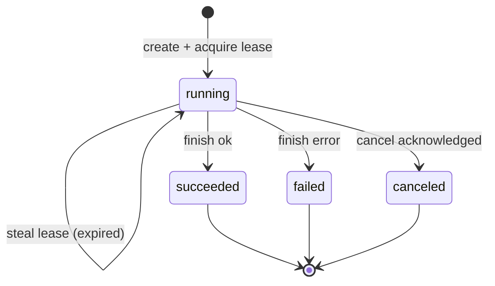

# Admin Console MVP：`ops_jobs` 数据模型与“全局唯一 + 租约”约束方案

> 目标：在 **MySQL / Postgres / SQLite**（gorm `AutoMigrate`）的最小交集能力下，设计一套可落地的 `ops_jobs` 表与约束方案，确保：
>
> 1) **同一 `job_type` 同一时间最多一个 `running`**（集群安全）
> 2) 通过 **lease** 机制避免 worker 异常退出导致永久占用，并支持超时后安全接管
> 3) 支持进度与失败摘要展示；支持取消语义与审计

参考：指南中 `ops_jobs` 字段建议与全局唯一要求见 [`docs/guides/admin-console-mvp-guide.md`](docs/guides/admin-console-mvp-guide.md:112)。项目 DB 支持类型见 [`backend/internal/db/db.go`](backend/internal/db/db.go:18)，迁移方式为 gorm `AutoMigrate` 见 [`backend/internal/db/migration.go`](backend/internal/db/migration.go:11)。

---

## 1. 数据模型（字段表格 + 解释）

### 1.1 表：`ops_jobs`

> 命名：指南建议 `ops_jobs`（或 `admin_jobs`），此处采用 `ops_jobs`。

| 字段名 | 类型（最小交集） | NULL | 默认 | 索引/约束 | 说明 |
|---|---|---:|---|---|---|
| `id` | BIGINT / INTEGER | 否 | 自增 | PK | gorm 常规主键；用于分页/排序更快。 |
| `job_id` | VARCHAR(36) | 否 | 生成 | UNIQUE | **业务主键**（UUID 字符串）。跨 DB 统一；避免依赖 DB 原生 uuid 类型。 |
| `job_type` | VARCHAR(128) | 否 |  | INDEX | 作业类型，如 `works.recalc_stats`。 |
| `job_version` | VARCHAR(64) | 是 | NULL | INDEX(可选) | “只跑一次”的版本标记（指南提及可选）。用于 `job_type+job_version` 去重（例如一次性 backfill）。 |
| `status` | VARCHAR(16) | 否 | `running` | INDEX | 枚举：`running/succeeded/failed/canceled`（指南）。 |
| `started_at` | DATETIME / TIMESTAMP | 是 | NULL | INDEX(可选) | 开始时间。建议在成功获取 lease 成为 owner 时设置。 |
| `finished_at` | DATETIME / TIMESTAMP | 是 | NULL | INDEX(可选) | 结束时间。状态变为终态（succeeded/failed/canceled）时设置。 |
| `lease_owner` | VARCHAR(128) | 是 | NULL | INDEX(可选) | 当前持有 lease 的 worker 标识（如 `hostname:pid` 或 `instance_id`）。用于可观测与争抢。 |
| `lease_token` | VARCHAR(64) | 是 | NULL |  | 每次成功获取/续租时生成的随机 token（或 uuid）。用于防止“旧 owner”误写。 |
| `lease_expires_at` | DATETIME / TIMESTAMP | 是 | NULL | INDEX | **租约到期时间**（指南）。running 状态必须设置；非 running 可为 NULL。 |
| `created_by_user_id` | BIGINT / INTEGER | 否 |  | INDEX | 触发者用户 ID（指南中审计建议）。 |
| `created_by_username` | VARCHAR(255) | 是 | NULL |  | 可选冗余字段（若当时用户名可得）。 |
| `trace_id` | VARCHAR(64) | 是 | NULL | INDEX(可选) | 请求链路追踪 ID（指南中审计建议）。 |
| `params` | TEXT | 是 | NULL |  | JSON 字符串，记录创建参数（跨 DB 通用；不要依赖 JSONB/JSON 类型）。 |
| `progress_total` | BIGINT / INTEGER | 否 | 0 |  | 总任务量（指南）。 |
| `progress_done` | BIGINT / INTEGER | 否 | 0 |  | 已完成量（指南）。 |
| `progress_failed` | BIGINT / INTEGER | 否 | 0 |  | 失败量（指南）。 |
| `error_summary` | TEXT | 是 | NULL |  | 失败摘要（文本或 JSON 字符串）。用于 UI 展示“失败原因概览/样本”。 |
| `error_details` | TEXT | 是 | NULL |  | 失败详情（可选）：更大体积的错误列表/堆栈样本/统计。 |
| `cancel_requested_at` | DATETIME / TIMESTAMP | 是 | NULL | INDEX(可选) | 取消请求时间。用于“软取消”。 |
| `canceled_at` | DATETIME / TIMESTAMP | 是 | NULL |  | 真正取消完成的时间（转 `canceled` 终态时）。 |
| `canceled_by_user_id` | BIGINT / INTEGER | 是 | NULL |  | 谁发起取消。 |
| `cancel_reason` | VARCHAR(255) | 是 | NULL |  | 取消原因（简短）。 |
| `created_at` | DATETIME / TIMESTAMP | 否 | now | INDEX | gorm 标准。 |
| `updated_at` | DATETIME / TIMESTAMP | 否 | now | INDEX | gorm 标准；也可用于简单乐观并发（但不如 version 明确）。 |
| `deleted_at` | DATETIME / TIMESTAMP | 是 | NULL | INDEX | gorm 软删（可选；若要保留历史，建议不启用软删或只做硬删除策略）。 |
| `lock_version` | BIGINT / INTEGER | 否 | 0 |  | 可选：**应用层乐观锁**计数（每次更新 +1）。跨 DB 通用。 |

#### 字段设计关键点

1) **`job_id` 用 VARCHAR(36)**：跨 MySQL/Postgres/SQLite 一致；gorm AutoMigrate 不需要依赖扩展（如 pgcrypto）。

2) **`params` / `error_*` 用 TEXT 存 JSON 字符串**：最小交集。若未来确定仅 Postgres，可升级为 JSONB 并加索引。

3) **建议添加 `lease_owner + lease_token`**：
   - `lease_owner`：方便排障（谁在跑）。
   - `lease_token`：防止“旧 owner”在 lease 过期后继续写入导致数据被污染。

4) **`lock_version`（可选但强烈建议）**：
   - 不依赖 DB 特性即可实现 CAS（compare-and-swap）式更新。
   - 用于续租/更新进度等高频更新时的并发安全。

---

## 2. 约束方案：running 全局唯一（按 DB 分类 + 统一折中）

指南要求：通过 DB 的唯一约束实现“同类型作业在同一时间只能存在一个 `running`”见 [`docs/guides/admin-console-mvp-guide.md`](docs/guides/admin-console-mvp-guide.md:127)。

这里的“全局唯一”指：**全表范围（跨租户/跨实例）**，同一 `job_type` 只能有 1 个 `status='running'`。

为便于讨论，本文把候选方案编号如下（后文会直接引用 A/B/C/D）：

- **方案 A（Postgres）**：Partial Unique Index（`WHERE status='running'`）
- **方案 B（MySQL）**：Generated Column + Unique（生成列投影 running）
- **方案 C（SQLite）**：Partial Unique Index（版本支持时）
- **方案 D（统一方案）**：**锁表 `ops_job_locks`**（跨 DB 最小交集）

### 2.1 推荐默认方案（MVP）与优先级

**默认主方案（MVP 统一落地）**：**方案 D：锁表 `ops_job_locks`**。

理由（结合本项目现状）：
- 项目 DB 需兼容 MySQL/Postgres/SQLite（见 [`backend/internal/db/db.go`](backend/internal/db/db.go:18)）。
- 迁移方式是 gorm `AutoMigrate`（见 [`backend/internal/db/migration.go`](backend/internal/db/migration.go:11)），而 partial index / generated column 通常需要额外 DDL；锁表只依赖最小交集能力（PK 唯一 + 条件 UPDATE）。

**可选优化优先级（非必须）**：
1. Postgres：Partial Unique Index（语义最直接、实现最短，但需额外 DDL）
2. MySQL：Generated Column + Unique（正确性强，但版本/方言风险更高）
3. SQLite：Partial Unique Index（依赖 SQLite 版本，且写并发受限）

> 注：即便启用上述索引优化，仍建议保留 `ops_job_locks` 作为统一的“协调入口”，避免在不同 DB 上维护两套关键路径。

---

### 2.2 Postgres 方案：Partial Unique Index（推荐）

**DDL 逻辑（伪 SQL）**：

```sql
CREATE UNIQUE INDEX IF NOT EXISTS ux_ops_jobs_running
ON ops_jobs (job_type)
WHERE status = 'running';
```

优点：
- 语义最贴合：只约束 running。
- 不影响历史记录（succeeded/failed/canceled 可重复）。

注意：
- 需要 migrations 或启动时执行一次 `Exec` DDL（AutoMigrate 不会自动建 partial index）。

---

### 2.3 MySQL 方案：Generated Column + Unique

MySQL 没有 partial unique index（不同版本能力差异大），可使用 **生成列** 把“running 的 job_type”投影到一个列，并对该列加唯一。

**DDL 逻辑（伪 SQL）**：

```sql
ALTER TABLE ops_jobs
  ADD COLUMN running_job_type VARCHAR(128)
    GENERATED ALWAYS AS (CASE WHEN status = 'running' THEN job_type ELSE NULL END) STORED,
  ADD UNIQUE KEY ux_ops_jobs_running (running_job_type);
```

解释：
- 当 `status != 'running'` 时 `running_job_type` 为 NULL（允许重复 NULL）。
- 当 `status = 'running'` 时，`running_job_type = job_type`，因此同 job_type 只能出现一次。

注意：
- 依赖 MySQL 版本（5.7+ 更稳；MariaDB 语法可能不同）。
- 同样需要 migrations 或 `Exec` DDL。

---

### 2.4 SQLite 方案：Partial Unique Index（如果版本支持）

SQLite 支持 partial index（3.8.0+）。

```sql
CREATE UNIQUE INDEX IF NOT EXISTS ux_ops_jobs_running
ON ops_jobs (job_type)
WHERE status = 'running';
```

注意：
- 需要确保目标环境 SQLite 版本满足；否则走 fallback。
- SQLite 并发写入受限，但项目已启用 WAL 与 `busy_timeout`（见 [`backend/internal/db/db.go`](backend/internal/db/db.go:26)），仍建议避免长事务。

---

### 2.5 统一 fallback：锁表 `ops_job_locks`

当无法依赖 partial index / generated column，或希望在所有 DB 上统一实现，可引入锁表：

#### 表：`ops_job_locks`

| 字段 | 类型 | 约束 | 说明 |
|---|---|---|---|
| `job_type` | VARCHAR(128) | PK | 锁粒度为 job_type。 |
| `lock_owner` | VARCHAR(128) |  | 当前持有者。 |
| `lock_token` | VARCHAR(64) |  | CAS token。 |
| `lease_expires_at` | DATETIME/TIMESTAMP | INDEX | 锁的租约到期时间（与 job 的 lease 类似）。 |
| `updated_at` | DATETIME/TIMESTAMP |  | 便于观测。 |
| `lock_version` | BIGINT/INTEGER |  | 乐观锁计数。 |

#### 约束与流程

- `ops_job_locks.job_type` 作为主键天然全局唯一。
- 创建 job 前，先抢锁；抢到锁才允许创建对应 running job。

优点：
- 最小交集、跨 DB 强一致。
- 可以把“全局唯一”的复杂性从 `ops_jobs` 转移到专门的锁资源上。

缺点：
- 多一张表与一段协议。

**建议**：
- 若团队接受为 MVP 增加一张表，推荐直接采用锁表作为统一方案；否则按 DB 走分方案。

---

## 3. 租约（lease）机制：获取/续租/超时抢占

核心思想：
- **running** 状态的 job 必须绑定一个 `lease_expires_at`。
- worker 必须周期性续租。
- 续租失败（因为 lease 过期且被其他实例抢占）时，旧 worker 必须停止执行并不再写入。

### 3.1 状态机（简化）



> 说明：严格来说“steal lease”是 running 内部 owner 的变更，不改变 status。

---

### 3.2 lease 获取（Create 语义）

两种常见实现：

- **实现 A：先插入 running job，然后 lease 通过条件更新确认 owner**（适合配合“running 全局唯一约束”）
- **实现 B：先抢 `ops_job_locks`，再插入 running job**（适合锁表 fallback）

下面给出可落地的 SQL 级别条件更新（CAS）写法；应用侧用 gorm `Updates` + `Where` 可表达。

#### A1. 插入 running job（依赖 running 唯一约束拦截并发）

```sql
INSERT INTO ops_jobs (
  job_id, job_type, status,
  lease_owner, lease_token, lease_expires_at,
  created_by_user_id, created_by_username, trace_id,
  params,
  progress_total, progress_done, progress_failed,
  started_at, created_at, updated_at, lock_version
) VALUES (
  :job_id, :job_type, 'running',
  :owner, :token, :now + :lease_ttl,
  :uid, :uname, :trace_id,
  :params_json,
  0, 0, 0,
  :now, :now, :now, 0
);
```

如果插入失败（唯一约束冲突），代表已有 running。

#### A2.（可选加强）再做一次“我确实是 owner”的确认更新

```sql
UPDATE ops_jobs
SET lease_owner = :owner,
    lease_token = :token,
    lease_expires_at = :now + :lease_ttl,
    updated_at = :now,
    lock_version = lock_version + 1
WHERE job_id = :job_id
  AND status = 'running'
  AND lease_owner = :owner
  AND lease_token = :token;
```

> 这一步更多用于统一逻辑；如果插入时已写入 owner/token，可省略。

---

### 3.3 续租（Renew）

续租必须保证：只有当前 owner 且 token 匹配的实例才能续租。

```sql
UPDATE ops_jobs
SET lease_expires_at = :now + :lease_ttl,
    updated_at = :now,
    lock_version = lock_version + 1
WHERE job_id = :job_id
  AND status = 'running'
  AND lease_owner = :owner
  AND lease_token = :token
  AND lease_expires_at > :now;  -- 可选：要求还没过期
```

结果行数：
- `1`：续租成功，继续跑。
- `0`：续租失败（可能已过期被抢占，或被取消/完成），必须停止执行。

> `lease_expires_at > now` 是否必需：
> - **推荐加上**：如果已经过期，旧 owner 不应再续租“复活”自己。
> - 允许“过期后续租”会造成抢占逻辑更复杂。

---

### 3.4 超时抢占（Steal / Takeover）

当发现 job `lease_expires_at <= now`，新的 worker 可尝试抢占。

```sql
UPDATE ops_jobs
SET lease_owner = :new_owner,
    lease_token = :new_token,
    lease_expires_at = :now + :lease_ttl,
    updated_at = :now,
    lock_version = lock_version + 1
WHERE job_id = :job_id
  AND status = 'running'
  AND lease_expires_at <= :now;
```

为防止“取消请求”后仍被抢占继续跑，建议加条件：

```sql
  AND cancel_requested_at IS NULL
```

> 是否需要额外比较旧 token：不需要。抢占只看过期。

---

### 3.5 强一致写入保护（防旧 owner 写进度/写完成）

所有“写进度 / 写错误 / 写 finished 状态”的更新都必须带上：

- `status = 'running'`
- `lease_owner = :owner`
- `lease_token = :token`
- （可选）`lease_expires_at > now`

示例：更新进度 done +1

```sql
UPDATE ops_jobs
SET progress_done = progress_done + 1,
    updated_at = :now,
    lock_version = lock_version + 1
WHERE job_id = :job_id
  AND status = 'running'
  AND lease_owner = :owner
  AND lease_token = :token
  AND lease_expires_at > :now;
```

如果返回 0 行，说明 lease 已失效，worker 必须停止。

---

## 4. 取消语义与字段（含审计建议）

指南建议取消语义（可选）见 [`docs/guides/admin-console-mvp-guide.md`](docs/guides/admin-console-mvp-guide.md:167)：
- 停止继续 enqueue 后续任务
- 已入队/已执行的不回滚

### 4.1 推荐语义：两段式取消

1) **请求取消**（Request Cancel）：
- API 将 `cancel_requested_at`、`canceled_by_user_id`、`cancel_reason` 写入
- 不立即改 `status`（仍可能需要 worker 清理）

```sql
UPDATE ops_jobs
SET cancel_requested_at = COALESCE(cancel_requested_at, :now),
    canceled_by_user_id = COALESCE(canceled_by_user_id, :uid),
    cancel_reason = COALESCE(cancel_reason, :reason),
    updated_at = :now,
    lock_version = lock_version + 1
WHERE job_id = :job_id
  AND status = 'running';
```

2) **确认取消**（Acknowledge Cancel）：
- worker 在主循环/批处理边界检查到 `cancel_requested_at IS NOT NULL` 后，停止继续 enqueue / 停止继续处理。
- worker 将状态切到终态 `canceled` 并写 `canceled_at`、`finished_at`。

```sql
UPDATE ops_jobs
SET status = 'canceled',
    canceled_at = :now,
    finished_at = :now,
    updated_at = :now,
    lock_version = lock_version + 1
WHERE job_id = :job_id
  AND status = 'running'
  AND lease_owner = :owner
  AND lease_token = :token;
```

> 这样可以保证：只有拥有 lease 的 worker 可以 finalize，避免“控制面”直接把 job 改为 canceled 但 worker 仍在跑。

### 4.2 取消与抢占的交互

- 抢占时建议加 `cancel_requested_at IS NULL`：若已请求取消，不应被新 worker 接管继续跑。
- 若希望“取消后也要清理并 finalize”，可以允许抢占但逻辑需确保最终状态一致；MVP 建议选择前者（更简单、更安全）。

---

## 5. 进度字段更新与失败摘要存储

### 5.1 进度更新原则

- 进度字段必须 **单调递增**（done/failed），避免回退。
- 更新必须带 lease 条件（见 §3.5），确保只有当前 owner 可写。
- `progress_total` 的来源：
  - 模式 `all`/`predicate`：可以先 dry-run 扫描统计总量后写入 total，再开始执行。
  - 模式 `work_id`：total = 1。

典型更新：

- 批处理开始时写 total：

```sql
UPDATE ops_jobs
SET progress_total = :total,
    updated_at = :now,
    lock_version = lock_version + 1
WHERE job_id = :job_id
  AND status = 'running'
  AND lease_owner = :owner
  AND lease_token = :token
  AND lease_expires_at > :now;
```

- 每成功处理一个 work：done + 1
- 每失败处理一个 work：failed + 1，并更新错误摘要（见下）

### 5.2 失败摘要：推荐存“聚合摘要 + 样本”

**`error_summary`（推荐 JSON 字符串）**：

```json
{
  "message": "recalc_stats failed for some works",
  "failed_count": 12,
  "sample": [
    {"work_id": 101, "err": "..."},
    {"work_id": 205, "err": "..."}
  ]
}
```

**更新策略**：
- 为避免并发拼接 JSON 的复杂度，MVP 可以采用：
  - 每次失败只在 `error_details` 追加一行文本（如 JSONL），或
  - 仅保留前 N 个样本（N=20），超过则只增加计数。

跨 DB 最小交集做法：
- `error_details` 存文本（JSONL），每次失败 append（注意：SQL 原子 append 语法跨 DB 不一致；如果要保持跨 DB，可在应用层先读后写，但要带 `lock_version` CAS）。

**更稳的 MVP 建议**：
- `error_summary` 只存“最后一次错误”+ 失败计数；
- `error_details` 可先不做 append，改为“最终失败时写一次汇总”。

---

## 6. 终态写入（succeeded/failed）建议

### 6.1 成功完成

```sql
UPDATE ops_jobs
SET status = 'succeeded',
    finished_at = :now,
    updated_at = :now,
    lock_version = lock_version + 1
WHERE job_id = :job_id
  AND status = 'running'
  AND lease_owner = :owner
  AND lease_token = :token;
```

### 6.2 失败完成

```sql
UPDATE ops_jobs
SET status = 'failed',
    finished_at = :now,
    error_summary = :summary,
    error_details = :details,
    updated_at = :now,
    lock_version = lock_version + 1
WHERE job_id = :job_id
  AND status = 'running'
  AND lease_owner = :owner
  AND lease_token = :token;
```

---

## 7. 风险、取舍与落地建议

### 7.1 依赖 DB 特性的风险

- Postgres partial index / MySQL generated column / SQLite partial index 都可能需要额外 DDL，且 gorm AutoMigrate 不自动建。
- 若想完全避免数据库特性差异，建议采用 `ops_job_locks` 作为统一方案。

### 7.2 SQLite 并发限制

- SQLite 单写者模型，虽然项目启用了 WAL 和 `busy_timeout`（见 [`backend/internal/db/db.go`](backend/internal/db/db.go:26)），但仍建议：
  - 缩短事务
  - lease 续租间隔不宜太高频（例如 5~15s）
  - 把“进度更新”合并为批量（例如每处理 10 个 work 更新一次）

### 7.3 Lease TTL 建议

- TTL 建议：30s~120s（取决于任务粒度）。
- 续租间隔：TTL 的 1/3 或 1/2（例如 TTL=60s，每 20~30s 续租）。

### 7.4 作业幂等

- `works.recalc_stats` 属于幂等重算类任务：重复跑不会破坏数据。
- 取消语义可采用“停止继续处理，不回滚”。

---

## 8. 可直接用于落地编码的检查清单

- [ ] `ops_jobs` 表：至少包含 `job_id/job_type/status/lease_expires_at/created_by_user_id/params/progress_*`（指南要求）
- [ ] 选择一种 running 全局唯一实现：
  - [ ] Postgres：partial unique index
  - [ ] MySQL：generated column unique
  - [ ] SQLite：partial unique index（或 fallback）
  - [ ] 统一 fallback：`ops_job_locks`
- [ ] 所有更新（续租/进度/完成）都必须带 `(job_id, status, lease_owner, lease_token[, lease_expires_at])` 条件
- [ ] 取消采用两段式（request + ack）并与抢占逻辑一致

