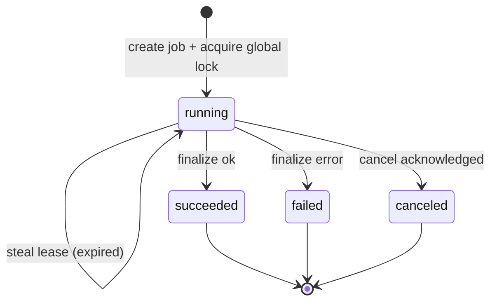
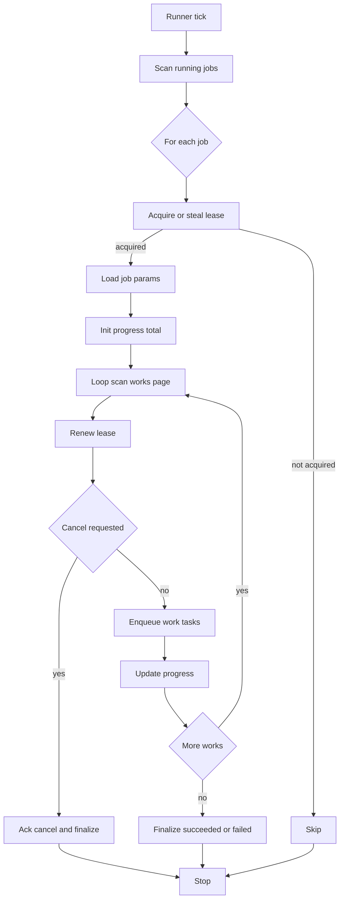
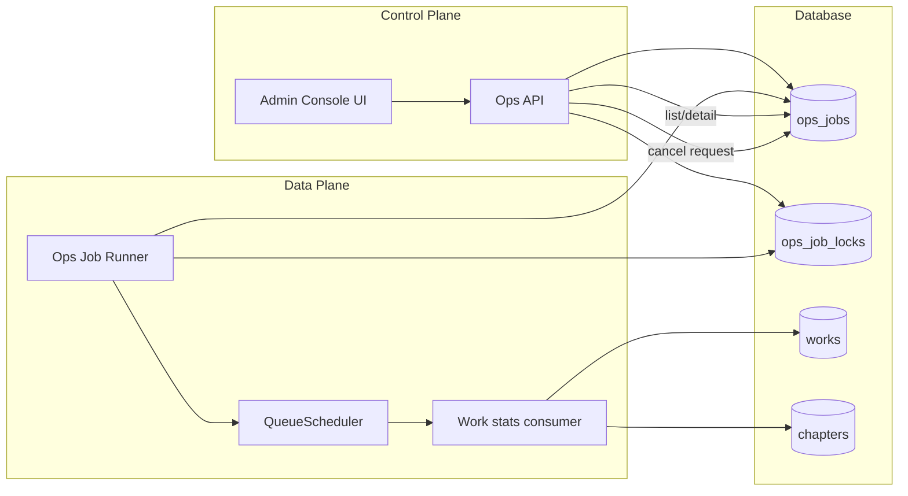
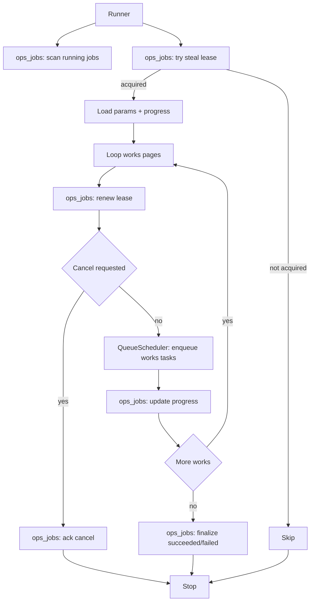
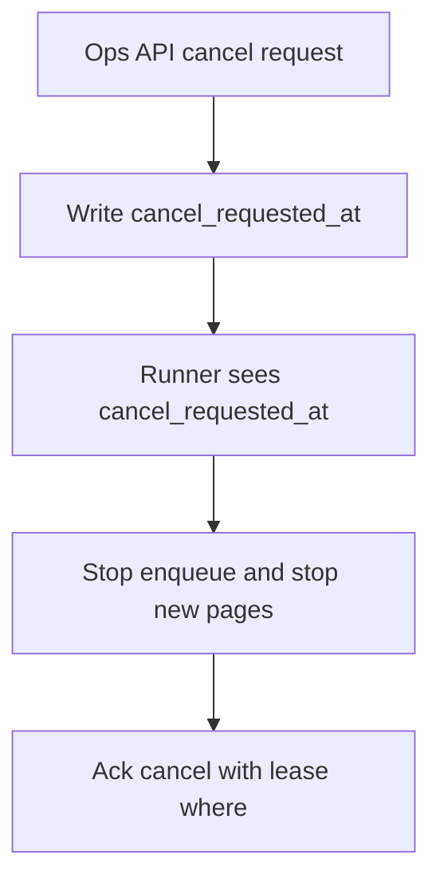

# Ops Job Runner 详细设计（`works.recalc_stats`）

> 本文档为“可直接落盘到交接文档”的 runner 详细设计小节素材，目标是把 runner 的组件边界、状态机与 DB 写入准则（where 条件、lease/token 保护、progress 单调、两段式 cancel）讲清楚，并提供可渲染的 Mermaid 图。
>
> 关键参考：
> - 指南：[`docs/guides/admin-console-mvp-guide.md`](docs/guides/admin-console-mvp-guide.md:1)
> - 设计稿（jobs + lease + cancel + progress）：[`tasks/admin-console-mvp/2.1_design/ops_jobs-model-and-uniqueness.md`](tasks/admin-console-mvp/2.1_design/ops_jobs-model-and-uniqueness.md:1)
> - 当前 Ops API 实现：[`backend/internal/services/ops/ops_service.go`](backend/internal/services/ops/ops_service.go:1)、[`backend/internal/repositories/gorm/ops_job_repository.go`](backend/internal/repositories/gorm/ops_job_repository.go:1)

---

## 1. Runner 的职责边界（与 Ops API / WorkService / QueueScheduler 的关系）

### 1.1 Runner 的核心职责

Runner（后端常驻 goroutine / 进程内 worker）负责把 `ops_jobs` 中的 `works.recalc_stats` 从“被创建”推进到“完成终态”，具体职责：

1) **抢占与维护 job lease**：确保同一时刻仅有一个执行者对 job 进行写入（通过 `lease_owner + lease_token + lease_expires_at`）。

2) **读取 job params 并驱动执行**：根据 params 中的 mode 扫描 works（分页），把每个 work 的重算任务投递到事件/队列系统，或在极简模式下直接调用内部逻辑。

3) **进度与错误汇总**：维护 `progress_total / progress_done / progress_failed` 与 `error_summary / error_details`（MVP 允许极简）。

4) **取消协议落地**：识别 `cancel_requested_at`（控制面请求取消），在安全边界处停机，并由 runner 进行 `status=canceled` 的确认落盘（两段式 cancel）。

5) **收敛到终态**：将 job 从 `running` 推进到 `succeeded / failed / canceled`，并设置 `finished_at`（以及 canceled 时的 `canceled_at`）。

### 1.2 Runner 不做什么（明确边界）

- **不负责对外 API**：创建/查询/请求取消由 Ops API 负责（已实现）[`backend/internal/controllers/ops/handler.go`](backend/internal/controllers/ops/handler.go:29)。
- **不直接重算统计口径**：重算逻辑必须复用已有的 works 模块消费逻辑 `WorkService.HandleWorkStatsTask()`，避免产生第二套口径 [`backend/internal/services/works/work_service.go`](backend/internal/services/works/work_service.go:68)。
- **不改变队列可靠性语义**：重试/DLQ/并发限制由现有 `QueueScheduler` 提供 [`backend/internal/events/scheduler.go`](backend/internal/events/scheduler.go:28)。

### 1.3 交互关系（建议的调用链）

- Ops API：负责
  - 创建 job（插入 `ops_jobs` running）+ 抢锁（`ops_job_locks`） [`backend/internal/services/ops/ops_service.go`](backend/internal/services/ops/ops_service.go:36)
  - 请求取消：写 `cancel_requested_at`（仅 request 阶段） [`backend/internal/repositories/gorm/ops_job_repository.go`](backend/internal/repositories/gorm/ops_job_repository.go:59)

- Runner：负责
  - 通过 lease 抢占 job、续租、推进进度、确认取消、写终态。

- WorkService：负责
  - 消费 works 模块任务，执行“按 work_id 重算”并写回 `works.total_*` [`backend/internal/services/works/work_service.go`](backend/internal/services/works/work_service.go:68)

- QueueScheduler：负责
  - in-app 队列：入队、去重、重试、DLQ、模块并发限制 [`backend/internal/events/scheduler.go`](backend/internal/events/scheduler.go:28)
  - 模块并发：通过配置覆盖（managed modules）[`backend/internal/cmd/events_runtime.go`](backend/internal/cmd/events_runtime.go:16)

---

## 2. Job 状态机与 lease owner/token 约束

### 2.1 状态机（MVP 终态集合）

- `running`：作业执行中，必须存在有效 lease
- `succeeded`：完成且无未处理失败（MVP 可定义为 `progress_failed==0` 或“按策略容错”）
- `failed`：执行过程中发生不可恢复错误（如 DB 查询失败、队列持续满等）
- `canceled`：取消已被 runner 确认并落盘（不是 API request）



### 2.2 lease 语义（写入保护）

`lease_owner + lease_token` 是“谁有权写 job 的强一致凭证”。原则：

- **所有 runner 对 job 的写操作必须带 lease 条件**（见 §3）。
- lease 续租失败（RowsAffected=0）即视为“失去执行权”：runner 必须停止继续 enqueue/执行，并不得再写任何进度或终态。
- 抢占仅允许在 `lease_expires_at <= now` 时发生；抢占成功后必须生成新的 `lease_token`，避免旧 owner 误写。

> 说明：当前 Ops API 创建 job 时把 `lease_owner="api"` 写入（便于展示），但 runner 抢占后会把 owner/token 改成 runner 的 identity。

---

## 3. DB 更新准则（where 约束、progress 单调、cancel 两段式）

### 3.1 统一硬约束：所有更新必须带 lease 条件 where

除“扫描读取”外，任何对 `ops_jobs` 的 `UPDATE` 都必须至少带上以下条件：

- `job_id = :job_id`
- `status = 'running'`
- `lease_owner = :owner`
- `lease_token = :token`

并**强烈建议**附加：

- `lease_expires_at > :now`

示例（伪 SQL，便于落地到 gorm）：

```sql
UPDATE ops_jobs
SET lease_expires_at = :now + :lease_ttl,
    updated_at = :now,
    lock_version = lock_version + 1
WHERE job_id = :job_id
  AND status = 'running'
  AND lease_owner = :owner
  AND lease_token = :token
  AND lease_expires_at > :now;
```

这条约束是为了实现：

- **旧 owner 不得写入**（token 不匹配）
- **lease 已过期不得“复活”**（expires_at > now）
- **终态之后不允许再写**（status=running）

设计稿中对“强一致写入保护”的原始表述见 [`tasks/admin-console-mvp/2.1_design/ops_jobs-model-and-uniqueness.md`](tasks/admin-console-mvp/2.1_design/ops_jobs-model-and-uniqueness.md:315)。

### 3.2 progress 更新规则：单调递增 + 批量合并

硬规则：

- `progress_done` / `progress_failed` **只能增加**，不能回退。
- 每次更新必须带 lease 条件 where（同 §3.1）。

建议（SQLite/写并发敏感）：

- 不要“每处理 1 条 work 就 UPDATE 一次 job”。
- 允许“每处理 N 个 work（如 10/20）或每隔 T 秒（如 2s）聚合一次更新”。

（可选）若做并发执行（多个 work 并行），则应以 DB 原子自增为准：

```sql
UPDATE ops_jobs
SET progress_done = progress_done + :delta_done,
    progress_failed = progress_failed + :delta_failed,
    updated_at = :now,
    lock_version = lock_version + 1
WHERE job_id = :job_id
  AND status = 'running'
  AND lease_owner = :owner
  AND lease_token = :token
  AND lease_expires_at > :now;
```

### 3.3 cancel 语义：两段式（request + ack）

现状：Ops API 的 cancel 仅写 request 字段（`cancel_requested_at` 等），并不改变 status [`backend/internal/repositories/gorm/ops_job_repository.go`](backend/internal/repositories/gorm/ops_job_repository.go:59)。

Runner 必须实现 ack：

1) **Request Cancel（控制面）**：
   - 条件：`job_id=? AND status='running'`
   - 写：`cancel_requested_at`（首次写入即可）、`canceled_by_user_id`、`cancel_reason`

2) **Acknowledge Cancel（runner）**：
   - 触发点：runner 在“批边界”或“续租 tick”读到 `cancel_requested_at IS NOT NULL`
   - 行为：停止继续 enqueue/执行，并在**持有 lease** 的前提下把 job 推进到 `canceled` 终态
   - where：必须带 `status=running AND lease_owner AND lease_token`（可选加 expires_at>now）

伪 SQL：

```sql
UPDATE ops_jobs
SET status = 'canceled',
    canceled_at = :now,
    finished_at = :now,
    updated_at = :now,
    lock_version = lock_version + 1
WHERE job_id = :job_id
  AND status = 'running'
  AND lease_owner = :owner
  AND lease_token = :token;
```

> 取消与抢占交互：建议抢占 where 中附加 `cancel_requested_at IS NULL`，避免“已请求取消的 job 被新 runner 接管继续推进”。见 [`tasks/admin-console-mvp/2.1_design/ops_jobs-model-and-uniqueness.md`](tasks/admin-console-mvp/2.1_design/ops_jobs-model-and-uniqueness.md:289)。

---

## 4. 执行流程（scan → 抢占/续租 → 扫描 works 分页 → enqueue/执行 → 更新 progress → finalize）

### 4.1 运行时组件（建议实现形态）

- `OpsRunner`：主循环（ticker）
- `JobExecutor`：按 job_type 分发 executor（本期仅 `works.recalc_stats`）
- `LeaseManager`：对 job 的 acquire/renew/steal 封装（复用 §3 的 where 规则）
- `WorkScanner`：按 mode 产出 work_id 流（分页）
- `Enqueuer`：将 work_id 转换为 `QueueTask` 并投递到 `QueueScheduler`

> 注意：当前项目还未定义 runner 模块；本文只定义协议/边界与 SQL 条件要求。

### 4.2 “扫描可执行 job”策略（MVP）

Runner 主循环只关注：

- `job_type = 'works.recalc_stats'`
- `status = 'running'`

候选 query：

- 优先扫“需要接管”的：`lease_expires_at IS NULL OR lease_expires_at <= now`
- 或扫“owner 是我”的：`lease_owner=:me AND lease_token=:token`（用于续租/推进）

但为避免复杂度，MVP 可以采取：

- 每 tick 拉取少量 running job（limit=K），依次尝试 steal（expires<=now）或 renew（owner+token）。

### 4.3 works.recalc_stats 的执行策略（两种模式，推荐 enqueue）

**推荐（与指南一致）**：enqueue 到 works 模块，复用现有消费者逻辑：

- 消费入口：`WorkService.HandleWorkStatsTask()` [`backend/internal/services/works/work_service.go`](backend/internal/services/works/work_service.go:68)
- 调度器：`QueueScheduler.Enqueue()` [`backend/internal/events/scheduler.go`](backend/internal/events/scheduler.go:63)

Runner 仅负责生成“可去重的 event_id + payload(work_id)”并投递。

**备选（极简、非推荐）**：runner 直接调用 WorkService 的内部方法对每个 work 做计算与写回。

> 说明：由于系统已存在事件骨架，优先 enqueue 方案，避免 runner 持有长事务或直接耦合 works repo。

### 4.4 执行主循环（runner）伪流程

关键点：续租 tick 与 work 分页处理要解耦，避免长批次导致 lease 过期。



### 4.5 works 扫描（分页）

- 必须分页，避免一次性加载所有 works（指南强调“分页/批处理”[`docs/guides/admin-console-mvp-guide.md`](docs/guides/admin-console-mvp-guide.md:133)）。
- batch size 与并发由配置控制（见 §6）。

mode 与扫描策略建议：

- `mode=work_id`：直接处理一个 work（total=1）
- `mode=all`：按 id 升序分页（稳定）
- `mode=predicate`：MVP 可仅审计存档；若要执行则需将 predicate 翻译为 SQL where（注意跨 DB）

---

## 5. Mermaid：架构图 + 关键流程图

### 5.1 架构图（组件关系）



### 5.2 Runner 主循环（时序要点 / 兼容性优先）

> 说明：部分 Mermaid 渲染器（不同版本/插件）对 `sequenceDiagram` 的 `loop/alt/autonumber` 支持不一致。
> 这里将 5.2 改为 **flowchart** 表达时序要点，避免语法不兼容导致整份文档渲染失败。



### 5.3 Cancel ACK 流程（两段式）



---

## 6. 配置项建议（leaseTTL / renew interval / batch size / module concurrency）

建议以配置形式暴露（默认值给出可跑的 conservative 值）：

### 6.1 lease 相关

- `opsRunner.leaseTTLSeconds`：默认 60（建议范围 30~120）
- `opsRunner.renewIntervalSeconds`：默认 20（建议为 TTL 的 1/3~1/2）

> SQLite 下 lease 续租过于频繁会造成写竞争；宁可 TTL 稍大、续租稍稀。

### 6.2 扫描与入队节流

- `opsRunner.workScanBatchSize`：默认 200（每次从 works 表读多少 id）
- `opsRunner.enqueueBatchSize`：默认 50（每次 enqueue 多少个 work task）
- `opsRunner.progressFlushEveryN`：默认 10（每 N 个 work 更新一次 progress）
- `opsRunner.progressFlushIntervalMs`：默认 2000（或二选一触发）

### 6.3 模块并发（复用现有配置）

`QueueScheduler` 支持 module 并发限制，通过 `applySchedulerConcurrency()` 应用配置 [`backend/internal/cmd/events_runtime.go`](backend/internal/cmd/events_runtime.go:26)。

建议：

- 将 `events.ModuleWorks` 的并发限制作为“治理作业速度阀门”。
- ops runner 不需要自己实现复杂的 work 并发；优先依赖 scheduler 的模块并发。

---

## 7. 失败与重试策略（runner 侧）

### 7.1 enqueue 失败（queue 满 / 调度异常）

`QueueScheduler.Enqueue()` 在队列满时会返回 `queue is full` [`backend/internal/events/scheduler.go`](backend/internal/events/scheduler.go:79)。

Runner 策略建议：

- **短暂失败可重试**：遇到 queue full 时 sleep/backoff（例如 200ms~2s exponential），并在下一次 renew 成功后继续。
- 如果连续超过阈值（例如 30s）仍无法入队，则视为系统处于背压：
  - 选择 A：将 job 标记为 failed（写 error_summary），避免无限占用。
  - 选择 B：保留 running，但降低 enqueue 速率并持续重试（更像“等待系统恢复”）。

MVP 推荐：选择 B（因为这是运维 job，允许慢），但必须确保 lease 续租仍可成功。

### 7.2 work 重算失败（消费者侧失败）

`QueueScheduler` 已有 retry/DLQ 机制 [`backend/internal/events/scheduler.go`](backend/internal/events/scheduler.go:110)。

Runner 侧需要回答的问题：

- 如何得知某个 work 最终失败进 DLQ？

MVP 简化策略（可直接落地）：

- runner 只负责“投递任务”，不等待任务执行结果。
- 进度仅统计“已投递数量”，而不是“已成功写回 works 统计”。
- `progress_failed` 可先不做精确（或仅统计 runner 自己遇到的错误，如 enqueue 失败）。

增强策略（后续迭代）：

- 为每个 work task 引入可关联 job_id 的 payload 字段（例如 `payload.ops_job_id`），并在 works consumer 成功/失败时回写 ops_jobs（带 lease 条件或基于单独的 outbox 回调）。

> 本文档的 DB where 约束不变：即使 consumer 回写，也必须确保“谁有权写 job”的一致性（可改为 consumer 写 outbox，runner 汇总落盘）。

---

## 8. 风险与回滚建议（重点：SQLite 写并发限制）

### 8.1 SQLite 单写者风险

项目 SQLite 已启用 WAL 与 busy_timeout [`backend/internal/db/db.go`](backend/internal/db/db.go:25)，但仍然是“单写者 + 写锁竞争”模型。

风险点：

- runner 高频续租 + 高频 progress 更新，会与业务写入竞争写锁。
- works consumer 重算会更新 works 表，叠加竞争。

缓解策略：

1) **降低写频率**：
   - renewInterval 不要过短（建议 >= 10s）
   - progress 更新做批量合并（每 N 条/每 T 秒）

2) **缩短事务**：
   - runner 所有 DB 操作都应该是短 UPDATE/SELECT，不包长事务。

3) **降速开关**：
   - 降低 `events.ModuleWorks` 并发（通过配置）
   - 降低 enqueueBatchSize 与 scanBatchSize

### 8.2 回滚策略

- 如果 runner 引入后发现对 DB 压力过大：
  - 通过配置把 runner ticker 间隔调大（或直接关闭 runner 入口）
  - 将 works module 并发限制降至 1（已有配置应用机制）[`backend/internal/cmd/events_runtime.go`](backend/internal/cmd/events_runtime.go:26)

- 数据安全方面：`works.recalc_stats` 是幂等重算任务，重复跑不破坏数据（最多浪费资源）[`docs/guides/admin-console-mvp-guide.md`](docs/guides/admin-console-mvp-guide.md:75)。

---

## 9. 可直接复制到实现任务的检查清单（落地约束）

- [ ] Runner 任何 `UPDATE ops_jobs` 必须带：`job_id AND status='running' AND lease_owner AND lease_token`（可选加 `lease_expires_at > now`）
- [ ] 续租失败（RowsAffected=0）必须立刻停止并不再写入
- [ ] `progress_done/progress_failed` 只能单调递增；建议批量 flush
- [ ] cancel 必须两段式：API 只 request，runner ack 才改 `status=canceled`
- [ ] 抢占 where 建议加：`cancel_requested_at IS NULL`
- [ ] 分页扫描 works（不要全表加载）
- [ ] 节流优先用 `QueueScheduler` 的 module 并发限制（`events.ModuleWorks`）
