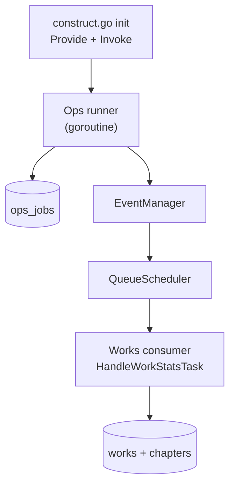

# Ops Runner 实现落点方案（`works.recalc_stats`）

> 目标：在开始写代码前，明确 `ops runner` 的 **包路径 / DI 启动点 / 与 events/works 的集成点**，并给出一个可直接按图实现的落地方案。
>
> 本文针对 runner：`works.recalc_stats`（由 Ops API 创建 `ops_jobs` 后，由 runner 推进并投递到 `events.ModuleWorks`，复用 `WorkService.HandleWorkStatsTask()`）。

---

## 1. 现状快照（与本方案相关的既有实现）

- **DI 容器与自启动模式**：在 [`backend/internal/cmd/construct.go`](backend/internal/cmd/construct.go:26) 中，对 [`events.NewNotifierWorker()`](backend/internal/cmd/construct.go:39) 采用 `Provide(...) + Invoke(...)` 的模式，通过 `Invoke(func(*events.NotifierWorker){})` 触发 worker 自启动。
- **works consumer 已存在**：[`backend/internal/apps/works/module.go`](backend/internal/apps/works/module.go:1) 已注册 `eventManager.RegisterConsumer(events.ModuleWorks, workService.HandleWorkStatsTask)`（见 [`backend/internal/apps/works/module.go`](backend/internal/apps/works/module.go:45)）。
- **scheduler 并发覆盖只对 managedModules 生效**：[`backend/internal/cmd/events_runtime.go`](backend/internal/cmd/events_runtime.go:1) 的 `managedModules`（见 [`backend/internal/cmd/events_runtime.go`](backend/internal/cmd/events_runtime.go:16)）决定了 [`applySchedulerConcurrency()`](backend/internal/cmd/events_runtime.go:26) 会给哪些 module 设置并发；当前不包含 ops。
- **模块并发限制按任务 module 生效**：[`QueueScheduler`](backend/internal/events/scheduler.go:28) 在消费时按 `task.Module` 获取 slot（见 [`backend/internal/events/scheduler.go`](backend/internal/events/scheduler.go:184)）。因此 **ops runner 投递到 `works` module 的任务**会被 `works` 的并发限制节流。

---

## 2. 推荐包路径（实现落点）

### 2.1 推荐：`backend/internal/services/ops/runner`

- **为什么放在 ops service 下**
  - runner 的核心读写对象是 `ops_jobs` / `ops_job_locks`，其生命周期由 Ops 控制面（Ops API）创建/取消驱动，天然属于 ops 域（ops module 当前入口见 [`backend/internal/apps/ops/module.go`](backend/internal/apps/ops/module.go:1)）。
  - 与 ops 的分层保持一致：`apps/ops` 做 wiring/路由；runner 作为 ops 的“数据面常驻执行器”，放在 ops service 子树更符合现有结构。
  - 便于未来扩展多个 `job_type` 的 executor（如 `works.recalc_stats` 之外的 ops 作业），避免把 ops 逻辑散落到 events/works。

### 2.2 备选：`backend/internal/apps/ops/runner`

- 仅当团队倾向把“模块内常驻组件”放在 apps 层时采用。
- 风险：apps 层目前主要是路由注册与 wiring；runner 逻辑较重，放 apps 可能导致 apps 目录混入大量业务执行代码。

结论：采用 **`backend/internal/services/ops/runner`**。

---

## 3. 推荐 DI wiring / 启动点（如何启动 runner）

### 3.1 推荐：在 `construct.go` 里 Provide + Invoke 触发启动

对齐现有 `NotifierWorker` 的启动模式：

- 启动入口：[`backend/internal/cmd/construct.go`](backend/internal/cmd/construct.go:26)
- 做法：
  - `container.Container.Provide(opsrunner.NewWorksRecalcStatsRunner)`
  - `container.Container.Invoke(func(*opsrunner.WorksRecalcStatsRunner){})`

runner 的构造/启动建议：

- 构造函数仅做依赖注入与参数校验；由 `Invoke` 触发 `Start()` 或触发内部 goroutine
- 依赖注入（建议最小集合）：
  - ops repo（jobs/locks）
  - `*events.EventManager`（推荐用它 `Dispatch`，见 §4）
  - 配置（ticker/leaseTTL/batch 等）

**理由**

- `construct.go` 是“全局基础设施 wiring + 各 module 空白导入激活”的集中入口，放 runner 启动不易漏掉。
- runner 属于“进程常驻后台 worker”，与 `NotifierWorker` 同类；沿用 Provide+Invoke 能保持启动语义一致。

### 3.2 备选：在 `api.go` 的 Invoke 块里启动/stop

- 入口参考：[`backend/internal/cmd/api.go`](backend/internal/cmd/api.go:57)
- 优点：可以跟随 `api` 命令生命周期做优雅停机。
- 缺点：`api.go` 现在的 invoke 块偏向 runtime/collector，不适合塞入过多业务 runner wiring；runner 也可能未来用于非 API 进程（独立 worker）。

**折中建议**

- MVP 先按 3.1 在 `construct.go` 启动。
- 若后续要“随 `apiCmd` 优雅停机”，再把 runner 的 `stopFn` 挂到 [`backend/internal/cmd/api.go`](backend/internal/cmd/api.go:57) 的 invoke 中（不影响包路径与 dispatch 方式）。

---

## 4. runner 如何投递任务到 works consumer（scheduler vs event manager）

### 4.1 推荐：runner 调用 `EventManager.Dispatch(...)`

runner 投递时构造一个 [`events.FactEvent`](backend/internal/events/contracts.go:70)，然后调用 [`EventManager.Dispatch()`](backend/internal/events/manager.go:66)：

- `Dispatch` 会根据 routes 把 event 转成 [`events.QueueTask`](backend/internal/events/contracts.go:82)，并调用 [`QueueScheduler.Enqueue()`](backend/internal/events/scheduler.go:63)。
- 这样可以保证：
  - 投递路径与系统现有 event-driven 语义一致
  - `QueueTask.PartitionKey` / `TaskID` 等字段由 EventManager 统一生成
  - 若未来 works module 的订阅关系变化（routes 调整），runner 不需要改 scheduler 的 consumer wiring

### 4.2 EventType 选择建议（避免污染“事实事件”）

现状里 [`WorkService.HandleWorkStatsTask()`](backend/internal/services/works/work_service.go:68) 只需要：

- 从 `payload.work_id` 解析 work id（优先），或
- 回退从 `partition_key` 解析（兜底）

因此 runner 只需保证 `payload.work_id` 稳定即可。

建议新增一个专用 `eventType`（更清晰、可观测）：

- 在 [`backend/internal/events/contracts.go`](backend/internal/events/contracts.go:1) 增加：`EventTypeWorksRecalcStats = "works.recalc_stats"`
- 在 [`backend/internal/apps/works/module.go`](backend/internal/apps/works/module.go:1) 增加 route：`eventManager.RegisterRoutes(events.EventTypeWorksRecalcStats, events.ModuleWorks)`（与现有 route 注册风格一致，见 [`backend/internal/apps/works/module.go`](backend/internal/apps/works/module.go:38)）

这样不会复用 `works.update`（避免把“重算”伪装成 update 事实），也便于 observability/告警区分。

> 本任务范围不要求改代码；这里仅明确“落地时需要新增 eventType + route”的改动点。

### 4.3 为什么不建议 runner 直接调用 `QueueScheduler.Enqueue(...)`

虽然可行（直接构造 `QueueTask{Module: events.ModuleWorks, ...}` 并拿到 works consumer 函数引用），但：

- runner 会被迫依赖 works consumer 的函数引用/DI 细节（跨模块耦合）
- 失去 routes 层抽象（将来 modules 订阅变更更难）

因此推荐 **EventManager.Dispatch**。

---

## 5. 事件/任务字段建议（幂等 + 可追踪）

### 5.1 幂等：利用 scheduler 的去重键 `event_id + module`

[`QueueScheduler.Enqueue()`](backend/internal/events/scheduler.go:63) 的 dedup key 是 `BuildDedupKey(task.EventID, task.Module)`（见 [`backend/internal/events/manager.go`](backend/internal/events/manager.go:113) 与 [`backend/internal/events/scheduler.go`](backend/internal/events/scheduler.go:64)）。因此：

- **同一个 work 的同一次 ops job 投递**应使用稳定的 `EventID`，以避免重复 enqueue。

推荐的 `FactEvent` 字段填充：

- `EventType`：`works.recalc_stats`
- `AggregateType`：`work`（即 [`events.AggregateTypeWork`](backend/internal/events/contracts.go:39)）
- `AggregateID`：`fmt.Sprintf("%d", workID)`
- `EventID`：`opsjob:{job_id}:work:{work_id}:recalc_stats:v1`
  - 包含 `job_id`：确保不同 job 之间不互相 dedup
  - 包含 `work_id`：确保同 job 内同 work 重复投递会被 dedup
  - `v1`：作为 schema 版本，便于后续 payload 变更
- `TraceID`：建议复用 `job_id` 或 `opsjob:{job_id}`（便于串日志）
- `Payload`（建议）：
  - 必选：`{"work_id": workID}`（让 `HandleWorkStatsTask` 走 payload 分支）
  - 可选：`{"ops_job_id": jobID, "trigger": "ops_runner"}`（利于排查；MVP 可不消费）

### 5.2 PartitionKey：交由 EventManager 生成

[`EventManager.Dispatch()`](backend/internal/events/manager.go:66) 会按 `BuildPartitionKey(aggregateType, aggregateID, module)` 生成 `PartitionKey`（见 [`backend/internal/events/manager.go`](backend/internal/events/manager.go:96)）。

选择 `AggregateType=work` + `AggregateID=<work_id>`：

- 可读性更好
- 与 `HandleWorkStatsTask` 的兜底解析兼容（见 [`parseWorkIDFromTask()`](backend/internal/services/works/work_service.go:120)）

---

## 6. module concurrency / managedModules 是否需要调整？

### 6.1 结论：不需要新增 `events.ModuleOps`，也不需要把 ops 加入 `managedModules`

原因分两层：

1) **runner 自身不通过 scheduler 执行**
   - module concurrency 机制只对 `QueueTask.Module` 生效（见 [`backend/internal/events/scheduler.go`](backend/internal/events/scheduler.go:184)）。
   - runner 是一个常驻 goroutine，不是一个 scheduler module consumer；把 ops 加入 `managedModules` 并不能限制 runner 自己的并发。

2) **runner 投递的任务 module 是 `works`**
   - 设计要求 enqueue 到 [`events.ModuleWorks`](backend/internal/events/contracts.go:28) 复用 [`WorkService.HandleWorkStatsTask()`](backend/internal/services/works/work_service.go:68)。
   - 因此所有重算任务会被 `works` 并发限制节流；调速应通过 `events.module_concurrency.works`（并发覆盖应用点见 [`backend/internal/cmd/api.go`](backend/internal/cmd/api.go:57) 与 [`backend/internal/cmd/events_runtime.go`](backend/internal/cmd/events_runtime.go:26)）。

### 6.2 什么时候才需要 `events.ModuleOps`

仅在未来引入“ops 自己也有被 scheduler 消费的任务”（例如 outbox、异步清理、长任务拆分）时，才有必要：

- 在 [`backend/internal/events/contracts.go`](backend/internal/events/contracts.go:28) 增加 `ModuleOps = "ops"`
- 在 [`backend/internal/cmd/events_runtime.go`](backend/internal/cmd/events_runtime.go:16) 的 `managedModules` 加入 `events.ModuleOps`
- 在 [`backend/internal/apps/ops/module.go`](backend/internal/apps/ops/module.go:1) 注册 `eventManager.RegisterConsumer(events.ModuleOps, ...)`

本次 runner（扫描 DB + dispatch works 任务）不需要。

---

## 7. 具体落地到哪些文件入口（可执行清单）

> 本节用于把“方案”落到明确改动点，方便后续按点实现。

### 7.1 新增 runner 包与构造函数

- 新增目录：`backend/internal/services/ops/runner/`
- 新增文件：`works_recalc_stats_runner.go`
  - 结构建议：
    - `type WorksRecalcStatsRunner struct { ... }`
    - `func NewWorksRecalcStatsRunner(jobRepo ..., lockRepo ..., eventManager *events.EventManager, cfg ...) *WorksRecalcStatsRunner`
    - `Start()` / `Stop()`

### 7.2 wiring：启动点

- [`backend/internal/cmd/construct.go`](backend/internal/cmd/construct.go:26)：
  - `Provide` runner
  - `Invoke` runner（触发 `Start()` / 自启动 goroutine）

### 7.3 events 路由：为 runner 增加专用 EventType（推荐）

- [`backend/internal/events/contracts.go`](backend/internal/events/contracts.go:5)：增加 `EventTypeWorksRecalcStats = "works.recalc_stats"`
- [`backend/internal/apps/works/module.go`](backend/internal/apps/works/module.go:38)：增加 `eventManager.RegisterRoutes(events.EventTypeWorksRecalcStats, events.ModuleWorks)`

### 7.4 并发配置：不改 managedModules，仅通过 works 并发调参

- 并发覆盖应用位置：[`backend/internal/cmd/api.go`](backend/internal/cmd/api.go:57)
- 并发覆盖逻辑：[`backend/internal/cmd/events_runtime.go`](backend/internal/cmd/events_runtime.go:26)
- 通过配置 `events.module_concurrency.works` 控制重算节流。

---

## 8. Mermaid：启动与投递路径（最终落地形态）

---

## 9. 最终推荐（TL;DR）

- **包路径**：`backend/internal/services/ops/runner`（ops 域数据面常驻组件）
- **启动点**：[`backend/internal/cmd/construct.go`](backend/internal/cmd/construct.go:26) 走 `Provide + Invoke`，对齐 `NotifierWorker` 自启动模式
- **投递方式**：runner 使用 [`EventManager.Dispatch()`](backend/internal/events/manager.go:66)，新增 `EventTypeWorksRecalcStats = "works.recalc_stats"` 并在 [`works module`](backend/internal/apps/works/module.go:1) 注册 route 到 [`events.ModuleWorks`](backend/internal/events/contracts.go:28)
- **幂等/追踪**：`EventID = opsjob:{job_id}:work:{work_id}:recalc_stats:v1`，payload 至少包含 `work_id`（可附加 `ops_job_id`）
- **concurrency**：不新增 `events.ModuleOps`、不改 `managedModules`；统一用 `events.module_concurrency.works` 作为速度阀门
