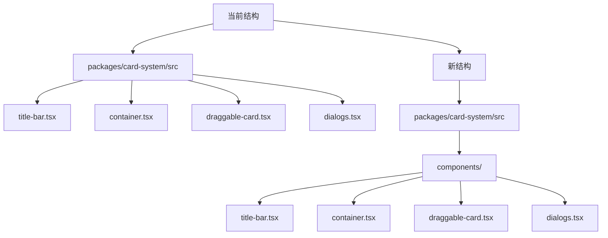

# Card System 目录结构优化方案

## 当前结构 vs 新结构

## 执行步骤
1. **创建组件目录**
   - 路径: `src/components/`

2. **移动组件文件**
   - `title-bar.tsx` → `components/title-bar.tsx`
   - `container.tsx` → `components/container.tsx`
   - `draggable-card.tsx` → `components/draggable-card.tsx`
   - `dialogs.tsx` → `components/dialogs.tsx`

3. **更新引用路径**
   - 修改文件: `card-system.tsx`, `card-component.tsx`, 测试文件等

4. **冗余代码检查**
   - 检查文件: `card-system.tsx`, `types.ts`, `card-factory.ts`, `card-component.tsx`
   - 重点: 重复类型定义, 相似UI逻辑, 通用工具函数

## 预期收益
- ✅ 更清晰的组件边界
- ✅ 更好的代码可维护性
- ✅ 减少重复代码量
- ✅ 更直观的目录结构

## 风险与缓解
- ⚠️ 路径更新遗漏 → 全面搜索引用关系
- ⚠️ 组件隐式依赖 → 添加接口文档注释